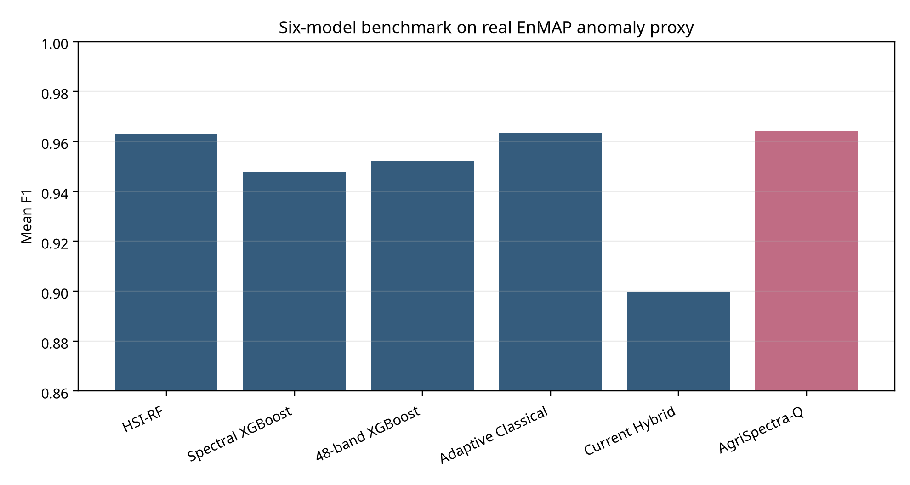

# AgriSpectra-Q

AgriSpectra-Q is a hyperspectral spectral-anomaly prioritisation proof of concept that converts real EnMAP imagery into ranked inspection candidates. It does not diagnose disease or pests; every priority zone requires field verification.

> **Team AgriSpectra-Q · Arab Youth Space Hackathon — 813 Challenge · Theme: Precision Agriculture**

[](backend/)
[](frontend/)
[](LICENSE)
[](https://colab.research.google.com/github/FreelancerDevBaggash/AgriSpectra-Q-/blob/main/notebooks/AgriSpectra_Q_Demo.ipynb)

---

## 1. Title and One-Line Summary

**AgriSpectra-Q** processes real EnMAP L2A hyperspectral scenes and returns ranked spectral-anomaly inspection zones. It is a decision-support prototype — not a disease diagnostic system.

---

## 2. Business Use Case

**Who is the user?** Agricultural extension officers and crop-monitoring field teams in regions with large, heterogeneous farmland — particularly in Sudan, China (Xinjiang), and Russia (Kamchatka), where manual field scouting is expensive and slow.

**What decision do they make?** Where to send limited field-inspection teams first, given a finite budget of time and personnel. A team that can inspect 5% of a large scene needs a reliable ranked list of the highest-priority areas.

**What do they use today?** Visual interpretation of RGB satellite imagery, calendar-based spray schedules, and ad-hoc ground reports — all reactive, low-resolution, and slow. No accessible hyperspectral decision-support tool currently exists for this user type at this scale.

---

## 3. The Problem

Crop stress, irrigation failure, and pest or disease onset are often invisible in standard RGB imagery until damage has already spread. Hyperspectral imagery captures subtle reflectance changes across 224 spectral bands that precede visible symptoms.

**Scale:** Agricultural losses from undetected early stress affect millions of hectares annually. Field teams cannot inspect more than a small fraction of any large scene manually.

**Why satellite hyperspectral data?** EnMAP L2A provides 224 bands at 30 m resolution with free scientific access, covering the full 400–2500 nm spectral range where key stress indicators (chlorophyll, water content, lignin) are detectable.

---

## 4. Data Used

| Dataset | Provider | Acquisition date | Level | Location | Licence |
|---------|----------|-----------------|-------|----------|---------|
| EnMAP L2A — DT0000192416 | ESA / DLR | 2026-04-30 | L2A surface reflectance | ad-Damer, Sudan | ESA EO Terms of Use |
| EnMAP L2A — DT0000174684 | ESA / DLR | 2026-01-09 | L2A surface reflectance | Karamay City, China | ESA EO Terms of Use |
| EnMAP L2A — DT0000203347 | ESA / DLR | 2026-07-10 | L2A surface reflectance | Kamchatka Krai, Russia | ESA EO Terms of Use |

**Data portal:** <https://planning.enmap.org/>  
**Download instructions:** [`data/sample_input/download_sample.py`](data/sample_input/download_sample.py)

> Raw GeoTIFF files (~400–450 MB each) are not stored in this repository. Three committed 256 × 256 spatial crops are in `data/sample_input/` for pipeline verification. Pre-computed full-scene outputs are in `results/live_matrix/`.

---

## 5. Technical Approach

**Workflow (in execution order):**

```
Input: EnMAP L2A GeoTIFF (224 bands, 30 m)

1. Band selection
   32 evenly-spaced indices across 224 bands
   → preserves full spectral range (VIS, NIR, SWIR)

2. Pass 1 — Scene statistics  (Welford online algorithm, streaming windows)
   Per block: read 32 bands → mask nodata → update running mean μ and σ²
   → Global μ ∈ ℝ³², σ ∈ ℝ³²

3. Pass 2 — Per-pixel spectral-anomaly score
   z_b = (x_b − μ_b) / σ_b        ← z-score per band
   risk = sqrt( mean(z_b²) )       ← RMS across 32 bands

4. Priority assignment  (scene-relative percentile thresholds)
   risk ≥ 95th pct  →  HIGH PRIORITY (3)
   risk ≥ 80th pct  →  MEDIUM        (2)
   risk ≥ 50th pct  →  LOW           (1)

5. Zone detection
   Connected components on HIGH PRIORITY pixels (8-connectivity)
   Minimum zone size: 9 pixels (~0.81 ha at 30 m)
   Zones ranked by mean_risk descending

6. Outputs per scene
   zones.csv · zones.geojson · spectral_evidence.csv · inspection_budget.csv
```

---

## Two separate evaluation modes

### Frozen six-model benchmark

The frozen benchmark contains 90 precomputed runs: 6 models × 3 real EnMAP scenes × 5 random seeds. Its target is a scene-local spectral-anomaly proxy, not an independently labelled disease or pest outcome. The benchmark uses sampled pixels (up to 7,000 per scene) and grouped spatial splits; it is not an exhaustive full-raster disease evaluation.

### Live Matrix engine

The live engine is an unsupervised spectral-anomaly prioritisation pipeline. It uses RMS standardised deviation over 32 selected EnMAP bands and returns priority zones. Live zone counts are not F1 scores and live outputs are not part of the frozen six-model benchmark.

### Reviewer sample demo

The files in `data/sample_input/` are 256 × 256 spatial crops from the real EnMAP L2A scenes. Outputs generated from them are pipeline-verification outputs only. They are not full-scene benchmark results.

---

## 6. Installation

Requires **Python 3.11**.

```bash
git clone https://github.com/FreelancerDevBaggash/AgriSpectra-Q-.git
cd AgriSpectra-Q-
python -m venv .venv
source .venv/bin/activate          # Windows: .venv\Scripts\activate
pip install -r requirements.txt
```

**Frontend** (optional — for the full web interface):

```bash
cd frontend
npm install
```

Set `NEXT_PUBLIC_API_URL` in `frontend/.env.local`:

```env
NEXT_PUBLIC_API_URL=http://localhost:8765
```

---

## 7. How to Run

### Reproducible demo notebook (no full GeoTIFF required)

```bash
jupyter lab notebooks/AgriSpectra_Q_Demo.ipynb
```

Select **Restart Kernel → Run All Cells**.  
Runtime: ~30 seconds on a standard laptop. No GPU required.  
Reads pre-computed outputs from `results/live_matrix/` (Sudan primary scene).  
Also verifies the three sample crops in `data/sample_input/`.  
Writes figures to `results/figures/`.

### Backend API server

```bash
python backend/api/live_matrix_api.py
# → http://localhost:8765
```

### Live engine on a new scene

```bash
# Download a full scene first — see data/sample_input/download_sample.py
python backend/engine/live_matrix_engine.py \
       --scene data/sample_input/<your_scene>.tiff
# → results appear in results/live_matrix/<run_id>/
```

---

## 8. Example Input and Output

### Sample input (committed to `data/sample_input/`)

Three 256 × 256 spatial crops of the real EnMAP L2A scenes, all 224 bands retained:

| File | Source scene | CRS | Valid pixels |
|------|-------------|-----|-------------|
| `scene_01_sudan_sample.tif` | DT0000192416 — Sudan | EPSG:32636 | 100% |
| `scene_02_china_sample.tif` | DT0000174684 — China | EPSG:32645 | 100% |
| `scene_03_russia_sample.tif` | DT0000203347 — Russia | EPSG:32658 | 100% |

SHA-256 checksums: see [`metadata/`](metadata/).

### Example output



> This figure is generated from the frozen benchmark results. It is not a sample-crop output.

### Inspection-Budget Curve (Sudan full scene)


---

## 9. Results and Limitations

### Live engine — three full EnMAP scenes

| Scene | Location | HP Zones | Recall @5% budget | Processing |
|-------|----------|----------|-------------------|------------|
| DT0000192416 | ad-Damer, Sudan | **438** | ~100% | 43.1 s |
| DT0000174684 | Karamay City, China | **864** | >90% | 85.2 s |
| DT0000203347 | Kamchatka Krai, Russia | **63** | >90% | 20.1 s |

> HP Zone counts are live engine outputs — they are not F1 scores.

### Frozen six-model benchmark (90 runs, 5 seeds, 3 scenes)

> ⚠️ All six models are ranked numerically. AgriSpectra-Q has the highest numerical mean F1 in the frozen table. Statistical superiority over HSI-RF was not established because the paired confidence interval crosses zero. This conclusion applies to the AgriSpectra-Q versus HSI-RF comparison only; it is not a claim of statistical superiority over all five other models.

| Model | Mean F1 | PR-AUC | ROC-AUC |
|-------|--------:|-------:|--------:|
| **AgriSpectra-Q** | **96.40%** | **99.47%** | **99.87%** |
| Adaptive Classical | 96.34% | 99.47% | 99.86% |
| HSI-RF | 96.31% | 99.49% | 99.87% |
| 48-band model | 95.22% | 99.23% | 99.80% |
| Spectral XGBoost | 94.78% | 99.24% | 99.81% |
| Current Hybrid | 89.98% | 96.16% | 98.75% |

Full validation report: [`results/industrial_validation/final_industrial_validation_report.md`](results/industrial_validation/final_industrial_validation_report.md)

### Limitations

- **No independent field labels.** No field-labelled disease or pest targets exist. The benchmark target is a scene-local spectral-anomaly proxy.
- **No field validation.** Priority zones are spectral-anomaly candidates; they have not been verified against ground-truth disease or pest incidence.
- **No temporal persistence validation.** Results are from single acquisition dates per scene.
- **No blind external-scene validation.** All three scenes were used during development.
- **Benchmark is not exhaustive full-raster.** The benchmark code uses up to 7,000 sampled pixels per scene, not a complete raster evaluation.
- **Sample demo ≠ full-scene results.** Outputs from the 256 × 256 sample crops are pipeline-verification only and do not directly compare to full-scene benchmark results.
- **Statistical tie at the top.** AgriSpectra-Q vs HSI-RF: bootstrap 95% CI [−0.0012, +0.0027] crosses zero. No bootstrap test was run against the other four models.
- **Quantum component.** The quantum-inspired layer uses classical simulation only — no quantum hardware, no measured quantum advantage.
- **Band coverage.** The live engine uses 32 of 224 bands (evenly spaced) for speed.
- **Scene-relative thresholds.** Priority thresholds are computed per scene and are not calibrated to agronomic severity levels.
- **NoData gaps.** Valid pixels range from 61–75% across full scenes due to EnMAP scene geometry.

---

## 10. Team, Licence and Attribution

| Member | Role | Contribution |
|--------|------|-------------|
| **Asia Alhammadi** | Team Leader · Science & Backend Lead | Problem definition, scientific protocol, hyperspectral pipeline, live geospatial processing engine, six-model benchmark, anomaly prioritisation, GeoTIFF/GeoJSON outputs, reproducible experiment infrastructure |
| **Ebrahim Baggash** | Frontend Engineer · UX Lead | Frontend architecture, interactive visualisation, map-based zone exploration, results presentation, UX design, GitHub repository organisation and technical review readiness |

**Licence:** MIT — see [LICENSE](LICENSE)

**Attribution:**
- EnMAP L2A data courtesy of the German Aerospace Center (DLR) and ESA. Free for scientific use at [enmap.org](https://www.enmap.org/).
- Benchmark statistical comparison uses paired bootstrap resampling (scikit-learn, numpy).
- Bootstrap n = 10,000 replicates, AgriSpectra-Q vs HSI-RF only.

---

## Project Structure

```
AgriSpectra-Q/
├── README.md                              ← this file
├── requirements.txt                       ← pinned Python dependencies
├── notebooks/
│   └── AgriSpectra_Q_Demo.ipynb           ← demo notebook (runs end-to-end)
├── data/
│   └── sample_input/
│       ├── scene_01_sudan_sample.tif      ← 256×256 crop, DT0000192416
│       ├── scene_02_china_sample.tif      ← 256×256 crop, DT0000174684
│       ├── scene_03_russia_sample.tif     ← 256×256 crop, DT0000203347
│       └── download_sample.py             ← download script with exact scene IDs
├── metadata/                              ← JSON metadata + SHA-256 for each sample
├── results/
│   ├── example_output.png                 ← committed example figure
│   ├── figures/                           ← notebook-generated figures
│   ├── live_matrix/                       ← pre-computed full-scene engine outputs
│   │   ├── AGRQ-LIVE-API-bd454893/        ← Sudan  (DT0000192416)
│   │   ├── AGRQ-LIVE-API-4c6010c5/        ← China  (DT0000174684)
│   │   └── AGRQ-LIVE-API-64988fb3/        ← Russia (DT0000203347)
│   └── industrial_validation/             ← frozen 6-model benchmark results
├── scripts/
│   └── validate_sample_inputs.py          ← verifies sample TIF integrity
├── backend/
│   ├── api/live_matrix_api.py             ← Flask REST server (port 8765)
│   ├── engine/live_matrix_engine.py       ← spectral-anomaly core engine
│   └── benchmark/                         ← frozen 6-model validation scripts
├── frontend/                              ← Next.js 15 web interface
├── docs/                                  ← architecture & specification documents
└── LICENSE
```

---

## Scientific Boundaries

> Output zones are **spectral-anomaly candidates** for field inspection.  
> They are **not** a confirmed disease or pest diagnosis.  
> All priority zones require independent field verification.  
> The benchmark evaluates a scene-local spectral-anomaly proxy — not an independently labelled biological outcome.
