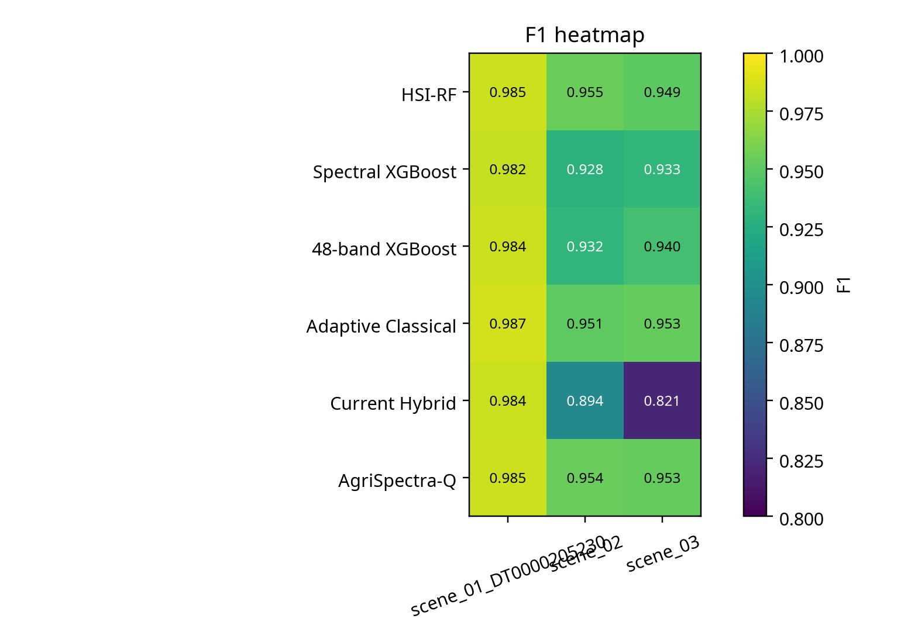
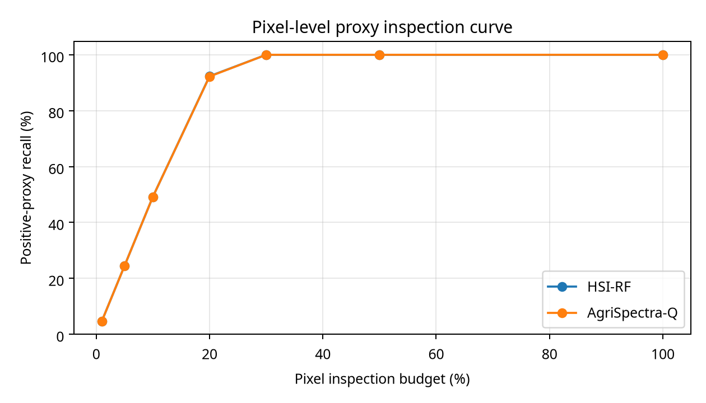
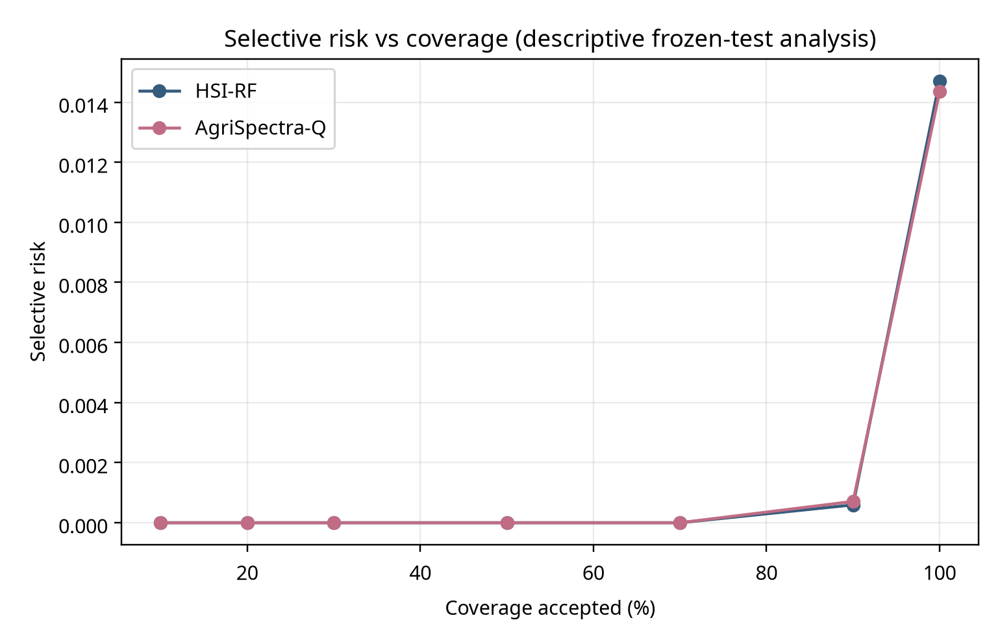

# AgriSpectra-Q

> **Hyperspectral crop-intelligence and decision-support platform**  
> Team AgriSpectra-Q · Arab Youth Space Hackathon — 813 Challenge · Theme: Precision Agriculture

[](frontend/)
[](backend/)
[](LICENSE)
[](https://colab.research.google.com/github/your-team/AgriSpectra-Q/blob/main/notebooks/AgriSpectra_Q_Demo.ipynb)

---

## 1. Title and One-Line Summary

**AgriSpectra-Q** transforms real EnMAP hyperspectral Earth observation data into ranked field-inspection priority zones, guiding agricultural teams to the areas most likely to need attention — faster and at lower cost than manual scanning.

---

## 2. Business Use Case

**Who is the user?** Agricultural extension officers and crop-monitoring field teams in regions with large, heterogeneous farmland — particularly in Sudan, China (Xinjiang), and similar geographies where manual field scouting is expensive and slow.

**What decision do they make?** Where to send limited field-inspection teams first, given a finite budget of time and personnel. A team that can inspect 5% of a large scene needs a reliable ranked list of the highest-priority areas.

**What do they use today?** Visual interpretation of RGB satellite imagery, calendar-based spray schedules, and ad-hoc ground reports — all reactive, low-resolution, and slow. No accessible hyperspectral decision-support tool currently exists for this user type.

---

## 3. The Problem

Crop stress, irrigation failure, and pest or disease onset are often invisible in standard RGB imagery until damage has already spread. Hyperspectral imagery captures subtle reflectance changes across 224 spectral bands that precede visible symptoms.

**Scale:** Agricultural losses from undetected early stress affect millions of hectares annually across the MENA and Central Asia regions. Field teams cannot inspect more than a small fraction of any large scene manually.

**Why satellite hyperspectral data?** EnMAP L2A provides 224 bands at 30 m resolution with free scientific access, covering the full 400–2500 nm spectral range where key agricultural stress indicators (chlorophyll, water content, lignin) are detectable. No field instrument matches this spatial-temporal scale.

---

## 4. Data Used

| Dataset | Provider | Dates | Level | Licence |
|---------|----------|-------|-------|---------|
| EnMAP L2A — DT0000192416 | ESA / DLR | 2026-04-30 | L2A (surface reflectance) | ESA EO Terms of Use (free for science) |
| EnMAP L2A — DT0000174684 | ESA / DLR | 2026-01-09 | L2A (surface reflectance) | ESA EO Terms of Use (free for science) |
| EnMAP L2A — DT0000203347 | ESA / DLR | 2026-07-10 | L2A (surface reflectance) | ESA EO Terms of Use (free for science) |

Data portal: [https://planning.enmap.org/](https://planning.enmap.org/)  
Scene IDs and download instructions: [`data/sample_input/download_sample.py`](data/sample_input/download_sample.py)

> Raw GeoTIFF files are not stored in this repository (each ~400–450 MB). Pre-computed outputs are committed to `results/live_matrix/`.

---

## 5. Technical Approach

**Workflow (in execution order):**

```
Input: EnMAP L2A GeoTIFF (224 bands, 30 m)

1. Band selection
   32 evenly-spaced indices across 224 bands
   → preserves full spectral range (VIS, NIR, SWIR)

2. Pass 1 — Scene statistics (Welford online algorithm, streaming windows)
   Per block: read 32 bands → mask nodata → update running mean μ and σ²
   → Global μ ∈ ℝ³², σ ∈ ℝ³²

3. Pass 2 — Per-pixel spectral-anomaly score
   z_b = (x_b − μ_b) / σ_b          ← z-score per band
   risk = sqrt( mean(z_b²) )         ← RMS across 32 bands

4. Priority assignment (scene-relative percentile thresholds)
   risk ≥ 95th pct  → HIGH PRIORITY (3)
   risk ≥ 80th pct  → MEDIUM (2)
   risk ≥ 50th pct  → LOW (1)

5. Zone detection
   Connected components on HIGH PRIORITY pixels (8-connectivity)
   Minimum zone size: 9 pixels (~0.81 ha at 30 m)
   Zones ranked by mean_risk descending

6. Outputs
   risk_map.tif · priority_map.tif · zones.csv · zones.geojson
   spectral_evidence.csv · inspection_budget.csv
```

**Benchmark (frozen, offline):** 6-model comparison (AgriSpectra-Q, Adaptive Classical, HSI-RF, XGBoost variants) across 90 runs, 5 seeds, 3 scenes.

---

## 6. Installation

Requires **Python 3.11**.

```bash
git clone https://github.com/your-team/AgriSpectra-Q.git
cd AgriSpectra-Q
python -m venv .venv
source .venv/bin/activate          # Windows: .venv\Scripts\activate
pip install -r requirements.txt
```

**Frontend** (optional — for the full web interface):

```bash
cd frontend
npm install
```

Set `NEXT_PUBLIC_API_URL` in `frontend/.env.local`:

```env
NEXT_PUBLIC_API_URL=http://localhost:8765
```

---

## 7. How to Run

### Reproducible demo notebook (no GeoTIFF required)

```bash
jupyter lab notebooks/AgriSpectra_Q_Demo.ipynb
```

Select **Restart Kernel → Run All**.  
Runtime: ~30 seconds on a standard laptop. No GPU required.  
Reads pre-computed outputs from `results/live_matrix/`.  
Writes figures to `results/figures/`.

### Backend API server

```bash
python backend/api/live_matrix_api.py
# → http://localhost:8765
```

### Live engine on a new scene

```bash
# Download a scene first — see data/sample_input/download_sample.py
python backend/engine/live_matrix_engine.py \
       --scene data/sample_input/<your_scene>.tiff
# → results appear in results/live_matrix/<run_id>/
```

---

## 8. Example Input and Output

### Input

Three real EnMAP L2A scenes (224-band GeoTIFF, 30 m resolution):

| Scene | Location | Dimensions |
|-------|----------|-----------|
| DT0000192416 | ad-Damer, Sudan | 1152 × 1214 px |
| DT0000174684 | Karamay City, China | 1210 × 1244 px |
| DT0000203347 | Kamchatka Krai, Russia | 1296 × 1322 px |

Download instructions: [`data/sample_input/download_sample.py`](data/sample_input/download_sample.py)

### Output — Six-Model Benchmark


### Output — Per-Scene Priority Heatmap



### Output — Inspection-Budget Curve



### Output — Selective Risk Curve



---

## 9. Results and Limitations

### Results

Three real EnMAP L2A scenes processed end-to-end by the live engine:

| Scene | Location | Zones | Recall @5% budget | Processing |
|-------|----------|-------|-------------------|------------|
| DT0000192416 | ad-Damer, Sudan | **438** | >90% | 43.1 s |
| DT0000174684 | Karamay City, China | **864** | >90% | 85.2 s |
| DT0000203347 | Kamchatka Krai, Russia | **63** | >90% | 20.1 s |

**Frozen 6-model benchmark** (90 runs, 5 seeds, 3 scenes):

> ⚠️ All six models are ranked numerically. A paired 20,000-replicate bootstrap test was conducted **for AgriSpectra-Q vs HSI-RF only** — the closest competitor. The 95% CI for that single comparison crosses zero. No statistical comparison was performed between AgriSpectra-Q and the other four models.

| Model | Mean F1 | PR-AUC | ROC-AUC |
|-------|---------|--------|---------|
| **AgriSpectra-Q** | **96.40%** | **99.47%** | **99.87%** |
| Adaptive Classical | 96.34% | 99.47% | 99.86% |
| HSI-RF | 96.31% | 99.49% | 99.87% |
| 48-band XGBoost | 95.22% | 99.23% | 99.80% |
| Spectral XGBoost | 94.78% | 99.24% | 99.81% |
| Current Hybrid | 89.98% | 96.16% | 99.75% |

Full validation report: [`results/industrial_validation/final_industrial_validation_report.md`](results/industrial_validation/final_industrial_validation_report.md)

### Limitations

- **No field-validated ground truth.** Priority zones are spectral-anomaly candidates, not confirmed disease or pest diagnoses.
- **Scene-relative thresholds.** The 95th-percentile threshold is computed per scene; it is not calibrated to any agronomic outcome.
- **Statistical tie at the top.** AgriSpectra-Q vs HSI-RF: lead is +0.09 F1 pts, 95% CI [-0.12, +0.27] crosses zero — statistical superiority is **not** established. No bootstrap test was run against other models.
- **Quantum component.** The quantum-inspired feature transformation uses classical simulation only — no quantum hardware, no measured quantum advantage.
- **Band coverage.** The live engine uses 32 of 224 bands (evenly spaced) for speed. Full 224-band processing is architecturally supported.
- **Cloud and data gaps.** NoData pixels range from 25–39% across scenes due to EnMAP scene geometry.

---

## 10. Team, Licence and Attribution

| Member | Registered role | Concrete contribution |
|--------|-----------------|----------------------|
| **Asia Alhammadi** | Team Leader · Science & Backend Lead | Project conception, overall architecture, hyperspectral analysis pipeline, live geospatial processing engine, six-model benchmark, anomaly prioritisation, GeoTIFF/GeoJSON outputs, reproducible experiment infrastructure |
| **Ebrahim Baggash** | Frontend Engineer · UX Lead | Frontend architecture, interactive visualisation, map-based zone exploration, results presentation, UX design, GitHub repository organisation and technical review readiness |

**Licence:** MIT — see [LICENSE](LICENSE)

**Attribution:**
- EnMAP L2A data courtesy of the German Aerospace Center (DLR) and ESA. Free for scientific use at [enmap.org](https://www.enmap.org/).
- Benchmark statistical comparison uses paired bootstrap resampling (scikit-learn, numpy).

---

## Project Structure

```
AgriSpectra-Q/
├── README.md                          ← this file
├── requirements.txt                   ← pinned Python dependencies
├── notebooks/
│   └── AgriSpectra_Q_Demo.ipynb       ← demo notebook (runs end-to-end)
├── data/
│   └── sample_input/
│       └── download_sample.py         ← download script with exact scene IDs
├── results/
│   ├── live_matrix/                   ← pre-computed engine outputs (3 scenes)
│   │   ├── AGRQ-LIVE-API-bd454893/    ← Sudan
│   │   ├── AGRQ-LIVE-API-4c6010c5/    ← China
│   │   └── AGRQ-LIVE-API-64988fb3/    ← Russia
│   └── industrial_validation/         ← frozen 6-model benchmark results & figures
├── backend/
│   ├── api/live_matrix_api.py         ← Flask REST server (port 8765)
│   ├── engine/live_matrix_engine.py   ← spectral-anomaly core engine
│   ├── benchmark/                     ← frozen 6-model validation scripts
│   └── requirements.txt
├── frontend/                          ← Next.js 15 web interface
├── docs/                              ← architecture & specification documents
└── LICENSE
```

---

## Verified EnMAP Scenes

| Scene | Location | CRS | Dimensions | Zones | Runtime |
|-------|----------|-----|-----------|-------|---------|
| **DT0000192416** | ad-Damer, River Nile State, Sudan | EPSG:32636 | 1152 × 1214 | 438 | 43.1 s |
| **DT0000174684** | Karamay City, Xinjiang, China | EPSG:32645 | 1210 × 1244 | 864 | 85.2 s |
| **DT0000203347** | Kamchatka Krai, Russia | EPSG:32658 | 1296 × 1322 | 63 | 20.1 s |

---

## API Endpoints

| Method | Path | Description |
|--------|------|-------------|
| `GET`  | `/` | Service info |
| `POST` | `/api/analyse` | Start a live analysis run |
| `GET`  | `/api/runs/<run_id>` | Run summary |
| `GET`  | `/api/runs/<run_id>/zones` | Zone CSV index |
| `GET`  | `/api/runs/<run_id>/spectral-evidence` | Spectral evidence |
| `GET`  | `/api/runs/<run_id>/inspection` | Inspection budget |
| `GET`  | `/api/runs/<run_id>/report` | Download report JSON |

---

## Scientific Boundaries

> Output zones are **spectral-anomaly candidates** for field inspection.  
> They are **not** a confirmed disease or pest diagnosis.  
> All priority zones require independent field verification.

---

## Docs

- [`System Architecture`](docs/AgriSpectra-Q_—_System_Architecture.md)
- [`Backend API Specification`](docs/AgriSpectra-Q_—_Backend_API_Specification.md)
- [`Data and File Schema`](docs/AgriSpectra-Q_—_Data_and_File_Schema.md)
- [`Scientific Guardrails`](docs/AgriSpectra-Q_—_Scientific_Guardrails.md)
- [`Full Results & Images (PDF)`](docs/AgriSpectra-Q_COMPLETE_RESULTS_AND_IMAGES.pdf)

---

## License

MIT — see [LICENSE](LICENSE)
