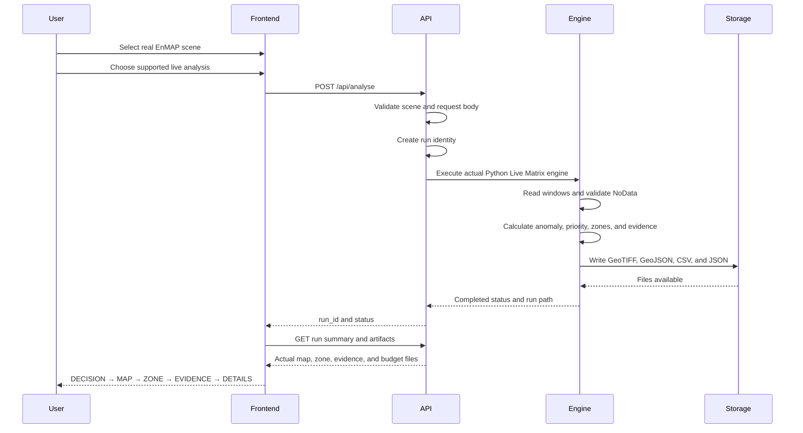

# AgriSpectra-Q — Backend API Specification

**Audience:** Backend, frontend, dashboard, geospatial, and scientific Python developers  
**Status:** Proof-of-concept API specification  
**Implementation rule:** The Python scientific engine is the source of truth.

> This document separates endpoints that are verified in the current project from endpoints that are proposed or required for a stronger PoC and future production system. A proposed endpoint must not be presented as already implemented.

## 1. Backend Position

AgriSpectra-Q is a hyperspectral Earth Observation decision-support system. The backend must expose real computation from the Python processing engine. It must not fabricate model metrics, return static JSON as if it were a new experiment, or move scientific calculations into the frontend.

The operational product flow is:

```text
DECISION → MAP → ZONE → EVIDENCE → TECHNICAL DETAILS
```

The output target is a **Spectral Anomaly Proxy**. It is not a confirmed disease, pest, infected-field, or biological-stress label.

## 2. Current Backend Components

The verified project components are:

| Component | Current role |
|---|---|
| `live_matrix_engine.py` | Executes the windowed Live Matrix analysis on real local EnMAP GeoTIFF scenes. |
| `live_matrix_api.py` | Flask development API connected to the actual Live Matrix engine. |
| `agrispectra_q_full.py` | Broader Python project architecture containing ingestion utilities, model code, evaluation helpers, visualisation, and the SAGE-QEC integration boundary. |
| `results/live_matrix/` | File-based storage for live run outputs. |
| `results/industrial_validation/` | Frozen benchmark and Decision Intelligence outputs. |
| `results/industrial_validation/dashboard/` | Dashboard prototype and data assets. |

There is no verified PostgreSQL, MySQL, MongoDB, or SQLite database in the current implementation. Current output storage is file-based and includes GeoTIFF, GeoJSON, CSV, JSON, manifests, reports, and dashboard data.

## 3. API Mode Separation

The backend must preserve two distinct modes.

### 3.1 LIVE EXPERIMENT

A Live Experiment runs the actual Python engine against a selected real EnMAP GeoTIFF scene. It creates a new run ID and writes new output files. Its outputs include risk and priority rasters, connected zones, spectral evidence, inspection-budget analysis, scene statistics, metrics, and a manifest.

A live request must never return hard-coded success values or a previous benchmark result while claiming that a new computation was executed.

### 3.2 FROZEN BENCHMARK

The Frozen Scientific Benchmark is a previously executed scientific reference experiment. It compares these six models:

1. HSI-RF.
2. Spectral XGBoost.
3. 48-band XGBoost.
4. Adaptive Classical.
5. Current Hybrid.
6. AgriSpectra-Q.

The benchmark may be exposed as read-only reference data. It is not a live model execution and must be labelled `FROZEN SCIENTIFIC BENCHMARK` in API responses and frontend displays.

The benchmark result is numerically led by AgriSpectra-Q with mean F1 0.963985 versus 0.963141 for HSI-RF. The paired 95% confidence interval for the difference crosses zero, so the backend and frontend must not describe AgriSpectra-Q as statistically superior.

## 4. Verified Current Endpoints

The following endpoints are verified from the current `live_matrix_api.py` implementation.

### 4.1 Root service information

**Status:** VERIFIED CURRENT  
**Method:** `GET`  
**URL:** `/`

#### Purpose

Return a service description, current mode label, and the endpoint names exposed by the current development API.

#### Authentication

No authentication requirement is verified in the current implementation. This is a development service and must not be assumed safe for public production exposure.

#### Request headers and body

No request body is required. Standard `Accept: application/json` is recommended.

#### Successful response

```json
{
  "service": "AgriSpectra-Q Live Matrix API",
  "mode": "LIVE ANALYSIS",
  "benchmark_mode": "FROZEN SCIENTIFIC BENCHMARK is separate",
  "endpoints": [
    "POST /api/analyse",
    "GET /api/runs/<run_id>",
    "GET /api/runs/<run_id>/zones",
    "GET /api/runs/<run_id>/spectral-evidence",
    "GET /api/runs/<run_id>/inspection",
    "GET /api/runs/<run_id>/report"
  ]
}
```

The exact root response may include implementation-specific formatting. Frontend code should use it for service discovery only and should not treat it as a full OpenAPI document.

#### Frontend usage

Use the endpoint as a lightweight health and capability check before enabling the Analysis Lab. Display a clear message if the service is unavailable.

#### Backend implementation notes

The current service is a Flask development server. Production deployment requires a production WSGI server, access control, request limits, logging, and monitoring.

### 4.2 Run a live analysis

**Status:** VERIFIED CURRENT  
**Method:** `POST`  
**URL:** `/api/analyse`

#### Purpose

Execute the real Python Live Matrix engine for one of the server-side EnMAP scenes.

#### Authentication

No authentication requirement is verified in the current implementation. Do not expose this endpoint publicly without adding authentication, authorisation, quotas, and resource controls.

#### Request headers

```http
Content-Type: application/json
Accept: application/json
```

#### Request body

The current implementation reads the `scene` field from a JSON object. The verified allow-list is:

```json
{
  "scene": "scene_03"
}
```

Accepted scene identifiers are:

```text
scene_01_DT0000205230
scene_02
scene_03
```

The current implementation does not verify a model selector, seed selector, upload payload, arbitrary AOI, or user-defined threshold through this endpoint. Those fields must not be presented as current capabilities.

#### Validation

The backend validates that `scene` belongs to the server-side allow-list. An unknown scene returns an HTTP 400 response. The engine then opens the corresponding local GeoTIFF and performs actual processing.

#### Successful response

```json
{
  "run_id": "AGRQ-LIVE-API-ceb0d53f",
  "scene": "scene_03",
  "path": "/home/ubuntu/AgriSpectra-Q/results/live_matrix/AGRQ-LIVE-API-ceb0d53f",
  "status": "completed"
}
```

The absolute path is useful in the current local PoC but should not be exposed to an external client in production. A production API should return an opaque run ID and artifact URLs instead.

#### Error responses

| Status | Current or proposed meaning |
|---:|---|
| 400 | VERIFIED CURRENT for an unsupported scene selection. |
| 500 | VERIFIED CURRENT for an exception raised during engine execution. |
| 422 | PROPOSED / REQUIRED for structurally valid JSON with invalid field values. |
| 503 | PROPOSED / REQUIRED when the engine or worker is unavailable. |
| 408 or 504 | PROPOSED / REQUIRED for request or worker timeout. |

#### Example request

```bash
curl -X POST http://localhost:8765/api/analyse \
  -H 'Content-Type: application/json' \
  -d '{"scene":"scene_03"}'
```

#### Frontend usage

When the user clicks **RUN ANALYSIS**, disable duplicate submissions, show a running state, and wait for the actual response. The frontend must display the returned run ID and mode as `LIVE ANALYSIS`. It must not load a saved frozen benchmark in place of the new run.

#### Backend implementation notes

The current implementation invokes `live_matrix_engine.py` as a subprocess. It waits for completion and stores the result under a run-specific directory. The current request is synchronous from the HTTP caller’s perspective. Future asynchronous job semantics are specified later in this document.

### 4.3 Retrieve a live run summary

**Status:** VERIFIED CURRENT  
**Method:** `GET`  
**URL:** `/api/runs/{run_id}`

#### Purpose

Return the `run_summary.json` generated by a completed live run.

#### Authentication

No authentication requirement is verified in the current implementation.

#### Request

```http
GET /api/runs/AGRQ-LIVE-API-ceb0d53f
Accept: application/json
```

#### Successful response

The response is the actual JSON contents of the run’s `run_summary.json`. Its structure includes the run ID, live mode, scene statistics, and limitations. The exact contents are run-specific and must be read from the artifact rather than hard-coded.

#### Error response

The current implementation returns HTTP 404 with an error object when the run summary does not exist.

```json
{
  "error": "run not found"
}
```

#### Frontend usage

Use this response to populate run-level status, scene metadata, processing summaries, and limitations. Use the scene-specific JSON files for detailed metadata.

### 4.4 List zone artifacts

**Status:** VERIFIED CURRENT  
**Method:** `GET`  
**URL:** `/api/runs/{run_id}/zones`

#### Purpose

Return an index of the scene-specific `zones.csv` files generated by the selected live run.

#### Successful response

```json
{
  "run_id": "AGRQ-LIVE-API-ceb0d53f",
  "live": true,
  "files": [
    {
      "scene": "scene_03",
      "path": "/home/ubuntu/AgriSpectra-Q/results/live_matrix/AGRQ-LIVE-API-ceb0d53f/scene_03/zones.csv",
      "download": "/api/runs/AGRQ-LIVE-API-ceb0d53f/files/scene_03/zones.csv"
    }
  ]
}
```

The current endpoint returns file references rather than parsing the CSV into a JSON zone array. Frontend code must follow the returned download route or use a future parsed response only after that behaviour is explicitly implemented.

### 4.5 List spectral-evidence artifacts

**Status:** VERIFIED CURRENT  
**Method:** `GET`  
**URL:** `/api/runs/{run_id}/spectral-evidence`

#### Purpose

Return an index of scene-specific `spectral_evidence.csv` files created by the live run.

#### Successful response

The response follows the same file-index pattern as the zones endpoint, with the filename `spectral_evidence.csv`.

The current evidence artifact reports band index and observed mean values. The current live artifact does not provide verified wavelength metadata, so the API must not invent wavelength values or claim a biological interpretation.

### 4.6 List inspection-budget artifacts

**Status:** VERIFIED CURRENT  
**Method:** `GET`  
**URL:** `/api/runs/{run_id}/inspection`

#### Purpose

Return an index of scene-specific `inspection_budget.csv` files generated by the live run.

#### Successful response

The response follows the same file-index pattern as the zones endpoint, with the filename `inspection_budget.csv`.

The file contains pixel-level proxy inspection coverage, not confirmed diseased-field coverage. The frontend must show that distinction.

### 4.7 Retrieve the run report endpoint

**Status:** VERIFIED CURRENT, but the current response is a JSON summary rather than a PDF or Markdown report  
**Method:** `GET`  
**URL:** `/api/runs/{run_id}/report`

#### Purpose

Return the current run summary through a report-labelled route.

#### Successful response

The current implementation serves `run_summary.json` with an `application/json` response. The endpoint must not be described as returning a PDF report in its current form.

#### Proposed improvement

A future report endpoint may return a generated Markdown or PDF artifact. That is **PROPOSED / REQUIRED**, not current behaviour.

### 4.8 Download a specific run artifact

**Status:** VERIFIED CURRENT in the source implementation  
**Method:** `GET`  
**URL:** `/api/runs/{run_id}/files/{scene}/{filename}`

#### Purpose

Serve an allow-listed artifact for a specific live-run scene.

#### Allow-listed filenames

```text
zones.csv
spectral_evidence.csv
inspection_budget.csv
risk_map.tif
priority_map.tif
zones.geojson
scene_statistics.json
metrics.json
manifest.json
```

#### Validation

The filename must be in the server-side allow-list. The route constructs the path from the run ID, scene, and allow-listed filename. Production code should additionally validate the run ID and scene identifier against safe path patterns and prevent path traversal.

#### Successful response

The endpoint returns the actual artifact file. Content type depends on the file type and server configuration. A future production implementation should set explicit content types and content-disposition headers.

#### Error responses

- HTTP 400 for a filename that is not allow-listed.
- HTTP 404 if the run or artifact does not exist.

## 5. Proposed / Required Endpoints

The following endpoints are requested by the product workflow but are not verified as current in `live_matrix_api.py`. They must be implemented only with real engine integration.

### 5.1 Upload a scene or AOI

**Status:** PROPOSED / REQUIRED  
**Method:** `POST`  
**URL:** `/api/upload`

#### Purpose

Accept a validated small AOI or subset for a controlled analysis workflow. Full-scene upload should remain optional because EnMAP files can be large.

#### Authentication

Required in production. No current authentication mechanism is verified.

#### Request

Use `multipart/form-data` with a file field and metadata fields. A production implementation should support a declared file type, maximum size, checksum, CRS declaration if present, and optional AOI.

#### Validation

Validate file extension, content signature, raster readability, dimensions, band count, NoData, CRS, transform, and allowed storage location. Reject arbitrary paths and unsupported formats. Do not execute uploaded files.

#### Proposed response

```json
{
  "upload_id": "UPL-2026-000001",
  "status": "validated",
  "filename": "aoi_subset.tif",
  "dimensions": [1024, 1024],
  "bands": 224,
  "crs": "EPSG:32753",
  "checksum": "sha256:..."
}
```

The exact schema is proposed and must be frozen before implementation.

### 5.2 Start a named experiment

**Status:** PROPOSED / REQUIRED  
**Method:** `POST`  
**URL:** `/api/experiments/run`

#### Purpose

Provide a stable job-oriented API that separates request acceptance from execution completion.

#### Proposed request

```json
{
  "dataset": "enmap_server_scene",
  "scene": "scene_03",
  "model": "AgriSpectra-Q",
  "parameters": {
    "inspection_budget": 0.2
  },
  "seed": 11
}
```

The current live engine does not verify all of these model and seed controls through the API. The backend must reject unsupported parameters rather than silently ignore them.

#### Proposed response

```json
{
  "id": "AGRQ-EXP-20260917-000001",
  "status": "QUEUED",
  "dataset": "enmap_server_scene",
  "scene": "scene_03",
  "model": "AgriSpectra-Q"
}
```

### 5.3 Retrieve experiment status

**Status:** PROPOSED / REQUIRED  
**Method:** `GET`  
**URL:** `/api/experiments/{id}`

#### Purpose

Expose a durable experiment lifecycle independently from a synchronous HTTP request.

#### Status states

```text
QUEUED
RUNNING
COMPLETED
FAILED
```

The current API does not verify a persistent queue or durable experiment registry. These states are proposed semantics for the required job model.

#### Proposed response

```json
{
  "id": "AGRQ-EXP-20260917-000001",
  "status": "RUNNING",
  "started_at": "2026-09-17T09:00:00Z",
  "completed_at": null,
  "processing_time": null,
  "outputs": [],
  "error": null
}
```

### 5.4 List available scenes

**Status:** PROPOSED / REQUIRED  
**Method:** `GET`  
**URL:** `/api/scenes`

#### Purpose

Return the actual server-side scene catalog that the frontend may display.

#### Proposed response

```json
{
  "scenes": [
    {
      "scene_id": "scene_01_DT0000205230",
      "filename": "scene_01_DT0000205230.TIF",
      "dimensions": [1153, 1198],
      "bands": 224,
      "resolution": 30,
      "CRS": "EPSG:32753",
      "valid_pixels": 1028176,
      "nodata_percentage": 25.56
    }
  ]
}
```

The response must be generated from actual metadata, not from hard-coded examples. The currently verified API does not expose this route.

### 5.5 Retrieve structured experiment results

**Status:** PROPOSED / REQUIRED  
**Method:** `GET`  
**URL:** `/api/results/{id}`

#### Purpose

Return a structured `AnalysisResult` object assembled from actual run artifacts.

The object should include run ID, mode, dataset, scene, metadata, quality, engine or model, metrics, risk thresholds, area statistics, zones, inspection outputs, processing timings, limitations, and reproducibility metadata.

### 5.6 Retrieve structured zones

**Status:** PROPOSED / REQUIRED  
**Method:** `GET`  
**URL:** `/api/results/{id}/zones`

#### Purpose

Return parsed zone records for frontend cards and map selection.

#### Proposed zone object

```json
{
  "zone_id": "scene_03-Z0129",
  "rank": 1,
  "priority": "HIGH PRIORITY",
  "score": {
    "mean_risk": 3.3913,
    "maximum_risk": 4.9171,
    "median_risk": 3.6088
  },
  "area": {
    "pixel_count": 365,
    "square_meters": 328500.0
  },
  "centroid": {
    "x": 568041.21,
    "y": 1969236.99,
    "available": true,
    "crs": "scene-specific source CRS"
  },
  "geometry": "if available",
  "spectral_evidence": "see evidence resource",
  "recommendation": "Field verification required."
}
```

The current live CSV supports zone ID, scene, pixel count, approximate area, centroid coordinates, mean risk, maximum risk, median risk, priority category, threshold type, recommendation, and rank. Geometry and additional fields are conditional on the GeoJSON artifact.

### 5.7 Retrieve structured evidence

**Status:** PROPOSED / REQUIRED  
**Method:** `GET`  
**URL:** `/api/results/{id}/evidence`

#### Purpose

Return parsed spectral-evidence records associated with a selected zone.

#### Proposed evidence object

```json
{
  "zone_id": "scene_03-Z0129",
  "band_index": 1,
  "wavelength": null,
  "wavelength_status": "unavailable in current artifact",
  "deviation": null,
  "reference": null,
  "spectral_metric": "observed_mean",
  "observed_mean": 0.123,
  "interpretation": "Spectral anomaly evidence; field verification required."
}
```

Do not invent wavelengths, reference spectra, causal explanations, or feature importance when the source artifact does not contain them.

### 5.8 Retrieve maps

**Status:** PROPOSED / REQUIRED  
**Method:** `GET`  
**URL:** `/api/results/{id}/map`

#### Purpose

Return or redirect to the actual `risk_map.tif` and `priority_map.tif` products.

The endpoint should preserve the raster CRS, affine transform, dimensions, datatype, and NoData value. The frontend should use a geospatial map renderer rather than converting a raster to an arbitrary image without metadata.

### 5.9 Retrieve inspection-budget analysis

**Status:** PROPOSED / REQUIRED  
**Method:** `GET`  
**URL:** `/api/results/{id}/inspection-budget`

#### Purpose

Return actual budget rows from the selected run, including selected-pixel count and pixel-level proxy-positive coverage.

The response must label the result as proxy inspection coverage. It must not call the result disease-field recall.

## 6. Common API Objects

### 6.1 Experiment

The following is the proposed logical object for asynchronous experiment tracking. Fields that are not written by the current API are marked as proposed.

| Field | Status and meaning |
|---|---|
| `id` | Current run IDs exist; durable experiment IDs are proposed. |
| `status` | `completed` is current for a successful synchronous run; `QUEUED`, `RUNNING`, and durable `FAILED` are proposed semantics. |
| `dataset` | Present conceptually; should identify the EnMAP scene source. |
| `scene` | Current live runs identify the selected scene. |
| `model` | Not a current Live Matrix API selector; proposed for a benchmark or model-execution API. |
| `parameters` | Current manifests contain run settings; a full API parameter object is proposed. |
| `seed` | Present in frozen benchmark experiments; not a verified current Live Matrix API input. |
| `started_at` | Recommended manifest field; not returned by the current run response. |
| `completed_at` | Recommended manifest field; not returned by the current run response. |
| `processing_time` | Current `scene_statistics.json` contains processing time. |
| `outputs` | Current run directories contain output paths; a structured API field is proposed. |
| `error` | Current API returns an error object on failures; persistent error state is proposed. |

### 6.2 Scene

| Field | Availability |
|---|---|
| `scene_id` | Available for the three server-side scenes. |
| `filename` | Available from local source paths; should be normalised before external exposure. |
| `dimensions` | Available from the GeoTIFF. |
| `bands` | Available from the GeoTIFF; current live scenes contain 224. |
| `resolution` | Available from the source transform; approximately 30 m in the current scenes. |
| `CRS` | Available from the GeoTIFF. |
| `valid_pixels` | Calculated in live scene statistics. |
| `nodata_percentage` | Calculated in live scene statistics. |

### 6.3 Zone

| Field | Availability |
|---|---|
| `zone_id` | Available in `zones.csv`. |
| `rank` | Available in `zones.csv`. |
| `priority` | Available as a relative operational category. |
| `score` | Available as mean, maximum, and median risk. |
| `area` | Available as pixel count and approximate square metres. |
| `centroid` | Available when the source geotransform exists. |
| `geometry` | Available in `zones.geojson` when georeferencing supports it. |
| `spectral evidence` | Available through the spectral evidence CSV, with current limitations. |
| `recommendation` | Available in the current zone table. |

### 6.4 Evidence

The current live spectral evidence supports band index and observed mean values. Wavelength, deviation, reference spectrum, and biological interpretation are conditional and must be returned as unavailable when the artifact does not contain them.

## 7. Common Error Contract

The following error semantics are required for the stronger API. Only some are currently verified by the development implementation.

```json
{
  "error": {
    "code": "INVALID_REQUEST",
    "message": "scene must be one of the supported server-side EnMAP scenes",
    "run_id": null,
    "details": {}
  }
}
```

| HTTP status | Meaning | Status |
|---:|---|---|
| 400 | Invalid request or unsupported scene selection. | VERIFIED CURRENT for unsupported scene in `/api/analyse`; general contract otherwise proposed. |
| 404 | Run, scene, or artifact not found. | VERIFIED CURRENT for missing run/artifact routes. |
| 422 | Validation failure after request parsing. | PROPOSED / REQUIRED. |
| 500 | Processing failure or unhandled engine exception. | VERIFIED CURRENT for engine exceptions in `/api/analyse`. |
| 503 | Engine unavailable, worker unavailable, or service overloaded. | PROPOSED / REQUIRED. |
| 408/504 | Timeout or gateway timeout. | PROPOSED / REQUIRED. |

## 8. Live Execution Requirements

A live experiment must execute the real Python engine. The backend must not use:

- Fake random metrics.
- Static JSON masquerading as live analysis.
- Hard-coded successful outputs.
- Frontend-only calculations presented as scientific analysis.
- Coordinates invented from a screenshot.
- Wavelengths copied from a generic sensor table when not present in the artifact.
- Disease or pest labels inferred from an anomaly score.

The engine must write a new run directory and a manifest. The API must return the run ID and expose the generated files from that run.

## 9. Frontend Request and Response Lifecycle



For future asynchronous execution, the API should return a queued run immediately and expose the status endpoint until the worker finishes.

## 10. CORS and Browser Access

### Current status

CORS configuration is not verified in the current `live_matrix_api.py`. A browser client should not assume cross-origin access is enabled.

### Required PoC behaviour

If the frontend and backend run on different origins, configure an explicit development allow-list. Do not use unrestricted `*` with credentials. Restrict allowed methods and headers to those required by the frontend.

### Production behaviour

Use an explicit production frontend origin, HTTPS, authentication-aware CORS, and preflight logging. Keep CORS separate from authentication; CORS is a browser policy, not an access-control mechanism.

## 11. File Size Handling and Path Safety

The backend must not require the browser to upload a full EnMAP scene for the primary PoC workflow. The preferred workflow is:

```text
SELECT EXISTING SERVER-SIDE SCENE → RUN ANALYSIS
```

An AOI or small subset upload may be supported as a secondary workflow. Full-scene upload is a future capability subject to storage and execution limits.

For uploads and artifact paths:

- Enforce a configured maximum file size.
- Stream uploads rather than loading them entirely into memory.
- Validate raster content with Rasterio.
- Generate server-side safe names.
- Ignore client-provided directory components.
- Use a run-specific directory.
- Reject `..`, absolute paths, and path separators in identifiers.
- Use an allow-list for artifact names.
- Never execute an uploaded file.
- Store temporary files outside the source tree.

The current artifact route has an allow-list, but production code should add stronger identifier validation and storage isolation.

## 12. Timeout and Resource Handling

The current measured scene processing times are approximately 37.14 seconds, 111.41 seconds, and 49.11 seconds. A synchronous HTTP request can therefore remain open for a substantial interval, especially under load.

The current API does not provide a verified durable timeout policy. The PoC should add a bounded subprocess timeout and return a structured failure when it expires. A production system should use an asynchronous queue and worker with explicit job timeouts, cancellation, retry policy, and concurrency limits.

The system must not invent RAM requirements or hardware benchmarks. It should measure actual resource usage in the target deployment environment before setting production limits.

## 13. Logging and Observability

Every request and run should be traceable by run ID. Logs should include:

- Request timestamp.
- Run ID.
- Scene ID.
- Mode.
- Engine version.
- Parameters and threshold configuration.
- Stage name.
- Start and end timestamps.
- Processing duration.
- Valid-pixel count.
- Zone count.
- Output paths.
- Exit status.
- Error details.

Logs must not contain passwords, provider tokens, authentication tickets, or secret environment variables.

A future production deployment should expose health, readiness, worker, disk, and queue metrics. These are not current verified endpoints.

## 14. Reproducibility and Deterministic Seeds

The backend must preserve reproducibility metadata in every real run. The manifest should contain the input identity, source path or object key, checksum where available, engine version, parameters, thresholds, code version, dependency environment, seed or seed list, timestamps, CRS, dimensions, and output paths.

The frozen benchmark used seeds 11, 22, 33, 44, and 55. The current Live Matrix API does not expose a seed parameter for its unsupervised scene analysis. The backend must not claim that a user-selected seed affected the current live run unless the engine actually receives and records it.

For benchmark endpoints, frozen results must be immutable and read-only. A live request must not overwrite benchmark artifacts.

## 15. Output Integrity and Geospatial Metadata

The backend must verify before returning success:

- The raster can be opened.
- Dimensions match the source.
- Band count and datatype are valid.
- NoData is recorded.
- Values are finite where expected.
- The output CRS is preserved.
- The output transform is preserved.
- Priority map dimensions match the risk map.
- Zone geometries are valid where GeoJSON is produced.
- Zone centroids are derived from the actual transform.
- The output files exist and are non-empty.
- The manifest lists the generated artifacts.

If a quality check fails, the API must return a failure state. It must not silently create a fallback result.

## 16. Frozen Benchmark Reference API

The frozen benchmark should be exposed separately from live execution.

### 16.1 Recommended read-only endpoint

**Status:** PROPOSED / REQUIRED  
**Method:** `GET`  
**URL:** `/api/benchmark/frozen`

The endpoint should return immutable reference metrics for the six models and clearly identify:

```json
{
  "mode": "FROZEN SCIENTIFIC BENCHMARK",
  "read_only": true,
  "models": [
    "HSI-RF",
    "Spectral XGBoost",
    "48-band XGBoost",
    "Adaptive Classical",
    "Current Hybrid",
    "AgriSpectra-Q"
  ],
  "statistical_note": "AgriSpectra-Q numerical F1 superiority over HSI-RF was not statistically established."
}
```

The benchmark endpoint must not start a new model fit. It must read the validated reference artifact and report its provenance.

### 16.2 Frontend display rule

The benchmark should be displayed as a comparison card or scientific reference view. It must not be labelled “live prediction” and must not be merged into a live run’s processing-time or zone output.

## 17. Acceptance Semantics

A successful live API response means only that the engine completed and wrote internally consistent artifacts. It does not mean that a disease was detected, that a field was validated, or that AgriSpectra-Q is superior to HSI-RF.

The product’s safe operational recommendation is:

> Spectral-stress evidence detected. Prioritise field inspection to determine the underlying cause. Field verification required.

## Backend acceptance checklist

- [ ] The backend identifies itself as `LIVE ANALYSIS` or `FROZEN SCIENTIFIC BENCHMARK` for every response.
- [ ] `POST /api/analyse` calls the actual Python engine for supported scenes.
- [ ] Unsupported scenes are rejected with a clear validation response.
- [ ] A unique run ID is created for every live execution.
- [ ] Each run has an isolated output directory and manifest.
- [ ] The backend never returns fake random metrics or static JSON as a live result.
- [ ] The frontend receives actual risk maps, priority maps, zones, evidence, and inspection outputs.
- [ ] GeoTIFF CRS, transform, dimensions, NoData, and datatype are preserved.
- [ ] GeoJSON is produced only when georeferencing supports it.
- [ ] Zone coordinates come from the actual raster transform.
- [ ] Unsupported wavelength or biological interpretations are marked unavailable.
- [ ] Errors are explicit and use the documented status semantics.
- [ ] Path traversal and arbitrary filesystem access are blocked.
- [ ] Upload size and raster-content validation are enforced before future upload support is enabled.
- [ ] Timeouts, subprocess failures, and disk errors are recorded.
- [ ] Run parameters, thresholds, seeds where applicable, timings, and outputs are recorded.
- [ ] Frozen benchmark data are read-only and visibly separated from live results.
- [ ] No disease, pest, ROI, field-validation, or quantum-advantage claim is generated by the API.
- [ ] The dashboard follows `DECISION → MAP → ZONE → EVIDENCE → TECHNICAL DETAILS`.
- [ ] Proposed endpoints are not presented as verified current endpoints.
