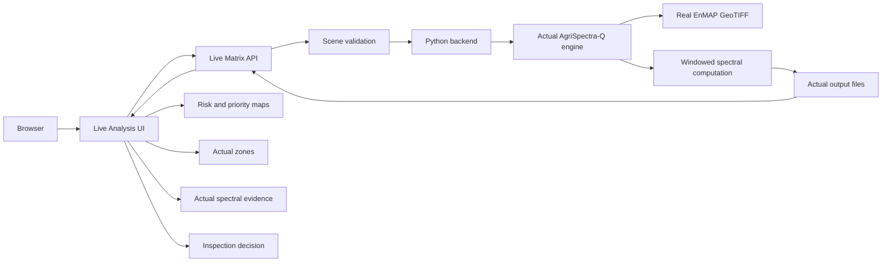

# AgriSpectra-Q — Demo and Experiment Protocol

**Document type:** Scientific-computing, real-experiment, and hackathon demonstration protocol  
**Audience:** Demo engineers, backend developers, frontend developers, scientific reviewers, and field-operations stakeholders  
**Status:** Industrial-oriented proof of concept

## 1. Purpose

AgriSpectra-Q must be demonstrated as a **real experiment platform**, not as a static information website or a research notebook with pre-filled screens.

When the user clicks `RUN LIVE ANALYSIS`, the system must execute supported backend computation against actual EnMAP data and return the output files generated by that execution.

The required live path is:

```text
Browser
  → API
  → Python backend
  → actual AgriSpectra-Q engine
  → actual EnMAP data
  → actual computation
  → actual output files
  → API
  → dashboard
```

The platform must never use random metrics, fake progress, invented zones, or static JSON presented as a newly executed analysis.

## 2. Demo Integrity Rules

The demonstration is scientifically credible only when the user can distinguish what was executed now from what was executed previously.

### 2.1 Prohibited behaviour

The demo must not use:

- Random metrics.
- Fake progress percentages.
- Hard-coded dynamic results presented as live.
- A simulated backend that does not call the Python engine.
- Static JSON presented as a new analysis.
- Invented zone geometries or coordinates.
- Fabricated spectral curves.
- A frozen benchmark labelled as a live model run.
- A successful result shown after an engine failure.

### 2.2 Required behaviour

The demo must:

- Use real server-side EnMAP scenes.
- Execute the actual supported Python engine.
- Create a unique run or experiment ID.
- Record the run metadata.
- Write actual output artifacts.
- Display the actual processing status.
- Show the actual processing time after completion.
- Expose the actual maps, zones, evidence, and manifests.
- Display the actual error when execution fails.
- Label fallback content as `FROZEN DEMONSTRATION RESULT`.

## 3. Live Experiment versus Frozen Benchmark

### 3.1 LIVE EXPERIMENT

A Live Experiment is an execution initiated by the user during the demonstration. It reads a supported real EnMAP GeoTIFF scene, invokes the Python Live Matrix engine, creates a new run directory, and returns artifacts generated by that execution.

The Live Matrix produces a spectral-anomaly prioritisation result. It does not confirm disease, pests, biological stress, or an infected field.

### 3.2 FROZEN BENCHMARK

The Frozen Benchmark consists of previously validated scientific results used for comparison and reference. It is read-only and must not be described as a new model fit or live inference run.

The six-model benchmark contains:

1. HSI-RF.
2. Spectral XGBoost.
3. 48-band XGBoost.
4. Adaptive Classical.
5. Current Hybrid.
6. AgriSpectra-Q.

The benchmark should be displayed with this exact label:

```text
FROZEN SCIENTIFIC BENCHMARK
```

The live and frozen modes must have different badges, different explanatory text, and different run metadata.

## 4. Demo Architecture



### 4.1 Current verified implementation

The current project contains:

- `live_matrix_engine.py` for windowed Live Matrix processing.
- `live_matrix_api.py` for the Flask development API.
- Real local EnMAP GeoTIFF scenes.
- File-based result storage.
- GeoTIFF, GeoJSON, CSV, JSON, and manifest outputs.
- A dashboard prototype with an Analysis Lab interface.

The current API supports the server-side live scene workflow. It does not verify arbitrary user file paths, a durable production job queue, a traditional database, or a full production authentication layer.

### 4.2 Current live request path

The verified live request uses a JSON scene selection such as:

```json
{
  "scene": "scene_03"
}
```

The current supported scene identifiers are:

```text
scene_01_DT0000205230
scene_02
scene_03
```

The API validates the scene, invokes the engine, waits for the subprocess to complete, and returns a run ID and output location. A production deployment should replace absolute local paths in external responses with controlled artifact URLs.

## 5. Live Experiment Page

### 5.1 Controls

The page should expose only controls that the backend actually supports.

Current supported control:

- Dataset or scene selection from the server-side EnMAP allow-list.

Controls that may be presented only after implementation and verification:

- Model selection.
- Analysis type selection.
- User-defined parameters.
- Optional seed.
- AOI upload.

If a control is not passed to the engine and recorded in the manifest, it must not appear to change the scientific computation.

### 5.2 Run button

The primary action is:

```text
RUN LIVE ANALYSIS
```

On click, the frontend must:

1. Disable duplicate submissions.
2. Send the supported request to the API.
3. Display the actual run state.
4. Show a real run ID when returned.
5. Navigate to results only after valid outputs exist.

### 5.3 Example live demonstration

```text
EnMAP Scene 1
  → Spectral anomaly Live Matrix
  → RUN LIVE ANALYSIS
  → actual backend computation
  → actual risk map
  → actual priority zones
  → actual spectral evidence
  → inspection recommendation
```

The phrase `AgriSpectra-Q` may be used for the broader product and frozen benchmark model. The live Matrix engine must still describe its current output accurately as a spectral-anomaly proxy.

## 6. Live Experiment State Model

The UI must show a truthful state. The current synchronous implementation can show `RUNNING` while the subprocess is active and `COMPLETED` or `FAILED` after the process returns. A durable queued state is a future capability.

```text
QUEUED       Future job-based execution
RUNNING      Actual engine process is executing
COMPLETED    Actual outputs exist and passed validation
FAILED       Actual processing or validation failure
```

### 6.1 Running state

Use:

```text
Analysing hyperspectral scene…

Reading valid spectral pixels
Calculating anomaly and priority information
Extracting high-priority zones
Writing geospatial outputs

Run ID: [actual run ID]
Scene: [actual scene]
Status: RUNNING
```

If stage-level progress is unavailable, use an indeterminate progress indicator. Do not display a fabricated percentage.

### 6.2 Completed state

The completed state must display:

- Experiment or run ID.
- Timestamp where recorded.
- Dataset and scene.
- Engine or model label.
- Parameters actually used.
- Processing time.
- Output files.
- Status.
- Caveat that the result is a spectral-anomaly prioritisation signal.

### 6.3 Failed state

Use:

```text
LIVE EXPERIMENT FAILED

The Python engine did not produce a valid result.
No live result is available for this run.

[VIEW ACTUAL ERROR] [TRY AGAIN]
```

Do not convert an exception into an apparently successful dashboard.

## 7. Observed Demo Timing

The current project recorded these real scene processing times:

| Scene | Observed processing time |
|---|---:|
| Scene 1 | 37.14 s |
| Scene 2 | 111.41 s |
| Scene 3 | 49.11 s |

These are observed project runs, not hardware-independent guarantees. They depend on data access, storage, CPU, memory, environment, and concurrent workload.

The demo should communicate that processing may take tens of seconds or longer. It should not promise a fixed completion time.

## 8. Experiment Log and Reproducibility

Each live run should ideally record:

- Experiment or run ID.
- Dataset.
- Scene.
- Model or engine label.
- Parameters.
- Seed where supported.
- Timestamp.
- Runtime.
- Status.
- Input identity or source path.
- CRS and dimensions.
- Output paths.
- Manifest.
- Engine and code version where available.
- Error information when failed.

The current file-based run structure is similar to:

```text
results/live_matrix/
└── AGRQ-LIVE-<timestamp>-<suffix>/
    ├── scene_01_DT0000205230/
    ├── scene_02/
    ├── scene_03/
    └── run_summary.json
```

A scene directory may contain:

```text
risk_map.tif
priority_map.tif
zones.csv
zones.geojson
spectral_evidence.csv
inspection_budget.csv
scene_statistics.json
metrics.json
manifest.json
```

The manifest must be checked before a run is marked complete.

## 9. Live Output Demonstration

The demo should show the actual outputs in operational order:

```text
DECISION
  → MAP
  → HIGH-PRIORITY ZONES
  → WHY FLAGGED?
  → SPECTRAL EVIDENCE
  → RECOMMENDATION
  → TECHNICAL DETAILS
```

### 9.1 Decision summary

Use actual run values:

```text
SPECTRAL PRIORITY ANALYSIS COMPLETE
High-priority zones: [actual value]
Inspection focus: [actual ranked zone]
Valid-pixel coverage: [actual value]
Processing time: [actual value]
```

The current live result is an anomaly-prioritisation output. The phrase `high-priority zones` must not be changed to `diseased fields` or `pest hotspots`.

### 9.2 Map

Show:

- Actual `risk_map.tif`.
- Actual `priority_map.tif`.
- Actual `zones.geojson` overlays.
- CRS-aware rendering.
- NoData masking.
- Legend with relative priority semantics.

### 9.3 Zone selection

The demonstrator should click the highest-ranked available zone. The selected zone must come from the actual `zones.geojson` and match the same `zone_id` in `zones.csv`.

### 9.4 Why flagged

Display the actual available evidence:

- Zone ID.
- Priority rank.
- Mean, maximum, and median risk where present.
- Pixel count and approximate area.
- Threshold type.
- Spectral evidence rows.
- Wavelength status.
- Recommendation.

If physical wavelength metadata are unavailable, say so. Do not draw a fabricated spectral curve.

### 9.5 Recommendation

Use:

```text
Spectral-stress evidence detected.
Prioritise field inspection to determine the underlying cause.
Field verification required.
```

This is an inspection recommendation, not a treatment recommendation.

## 10. Model Comparison Lab

The Model Comparison Lab displays the six-model benchmark as frozen reference data.

### 10.1 Exact reference values

#### AgriSpectra-Q

| Metric | Value |
|---|---:|
| F1 | 0.963985 |
| PR-AUC | 0.994732 |
| ROC-AUC | 0.998665 |
| Brier | 0.010909 |
| ECE | 0.007262 |

#### HSI-RF

| Metric | Value |
|---|---:|
| F1 | 0.963141 |
| PR-AUC | 0.994945 |
| ROC-AUC | 0.998742 |
| Brier | 0.010811 |
| ECE | 0.007245 |

The other four models must also be shown when the complete frozen benchmark artifact is loaded:

- Spectral XGBoost.
- 48-band XGBoost.
- Adaptive Classical.
- Current Hybrid.

### 10.2 Statistical limitation

AgriSpectra-Q’s F1 difference over HSI-RF is:

```text
+0.0008447 F1
```

The paired bootstrap 95% confidence interval is:

```text
[-0.0012054, +0.0026803]
```

Because the interval crosses zero, the demo must state:

```text
No statistically established superiority over HSI-RF.
```

The benchmark is evidence of competitiveness, not proof of universal superiority.

### 10.3 Benchmark display rule

The benchmark page must show:

```text
FROZEN SCIENTIFIC BENCHMARK
Read-only reference results.
Not a live model execution.
```

The demo must not show benchmark metrics immediately after a live run without an explicit mode transition.

## 11. Inspection-Budget Experiment

The inspection-budget view should support actual calculation where the corresponding backend implementation is available. The supported budget levels are:

```text
5%
10%
20%
30%
50%
```

The output must be labelled as **pixel-level proxy metrics**.

The frozen decision-intelligence summary reports:

| Budget | HSI-RF proxy recall | AgriSpectra-Q proxy recall |
|---:|---:|---:|
| 5% | 24.49% | 24.49% |
| 10% | 49.19% | 49.19% |
| 20% | 92.33% | 92.22% |

The demo must not call these values field inspection accuracy or confirmed crop detection.

If the calculation is not available for a selected live run, disable the control or state:

```text
Inspection-budget analysis is unavailable for this run.
```

Do not substitute frozen budget values while implying that they were calculated from the current live run.

## 12. Spectral Explorer

The Spectral Explorer may display the following only when the selected run actually provides them:

- Wavelength.
- Reflectance or observed spectral value.
- Anomaly.
- Reference.
- Deviation.
- Spectral signature.

The current live evidence artifact provides band index, observed mean, reference mean for the selected 32-band representation where present, and wavelength status. It does not verify physical wavelengths in the current output. Therefore:

- Display band index when wavelength metadata are unavailable.
- Display a truthful unavailable state for wavelengths.
- Never draw a smooth or realistic-looking synthetic curve.
- Never insert generic EnMAP wavelength values without reading them from the run metadata.
- Never interpret a spectral curve as proof of disease or pest identity.

Example truthful copy:

```text
Spectral Explorer
Band-level evidence available.
Physical wavelength metadata are unavailable in this run.
```

## 13. Real Dataset Policy

The demo uses actual EnMAP scenes. The current live scene set contains three real georeferenced scenes with 224 bands and approximately 30 m resolution.

If a dataset is unavailable, the platform must:

- Disable the experiment control.
- Explain that the dataset is unavailable.
- Preserve the actual error or availability state.
- Avoid substituting fabricated or synthetic data.

The platform must not silently switch to a screenshot, static JSON, or synthetic raster and label it as a live EnMAP result.

## 14. Error Handling

If processing fails, show the actual error at the appropriate technical level.

### 14.1 User-facing error

```text
Analysis could not be completed.

The engine did not produce valid output files.
Run ID: [actual if created]

[VIEW DETAILS]
```

### 14.2 Developer-facing details

Provide:

- Run ID.
- Scene.
- Engine exit status.
- Error message.
- Failed stage where known.
- Output directory.
- Existing artifacts, if any.
- Timestamp.

### 14.3 Failure rules

The system must not:

- Convert a failure into fake success.
- Show old outputs as current outputs.
- Mark a run complete when a required output is missing.
- Hide a path or CRS error behind an empty map.
- Create invented zones when GeoJSON generation fails.

## 15. Demo Script

The standard demonstration should follow these steps:

### Step 1 — Open the platform

Show the AgriSpectra-Q Home page and the `RUN LIVE ANALYSIS` call to action.

### Step 2 — Explain the problem in one sentence

Use:

> Large agricultural areas are expensive to inspect uniformly, so the system ranks spectral-anomaly candidates for field verification.

### Step 3 — Select an EnMAP scene

Choose one of the actual supported scenes. Display its available metadata without inventing values.

### Step 4 — Click `RUN LIVE ANALYSIS`

Show the request entering the backend. Keep the mode label visible.

### Step 5 — Show processing

Display the actual running state, run ID, scene, and truthful progress state. If only indeterminate progress is available, do not show a percentage.

### Step 6 — Show the priority map

After valid outputs are confirmed, render the actual risk and priority maps with zone overlays.

### Step 7 — Click the highest-priority zone

Select the zone using actual GeoJSON geometry and its exact `zone_id`.

### Step 8 — Show “Why flagged?”

Display the actual available score statistics, threshold type, spatial context, and spectral evidence status.

### Step 9 — Show spectral evidence

Display actual rows from `spectral_evidence.csv`. If wavelength metadata are unavailable, say so rather than drawing a fabricated curve.

### Step 10 — Show inspection recommendation

Use the actual generated recommendation and display `Field verification required`.

### Step 11 — Open the model benchmark

Navigate to the separate `FROZEN SCIENTIFIC BENCHMARK` view. Show the six-model comparison and the statistical limitation.

### Step 12 — Explain scientific limitations honestly

State that the target is a Spectral Anomaly Proxy, the live Matrix is not a disease or pest diagnosis, and AgriSpectra-Q’s numerical F1 advantage over HSI-RF is not statistically established.

### Step 13 — Show the roadmap

Explain future field validation, temporal data, blind external scenes, production orchestration, and measured operational pilots as future work.

The demo should feel like an operational system because it executes real computation and produces real geospatial artifacts. It should remain scientifically honest because it does not overstate what those artifacts mean.

## 16. Downloadable Results

The demo must provide downloads for actual generated files when the run completes:

```text
risk_map.tif
priority_map.tif
zones.csv
zones.geojson
spectral_evidence.csv
inspection_budget.csv
scene_statistics.json
metrics.json
manifest.json
```

Each download should identify:

- Run ID.
- Scene.
- Live or frozen mode.
- File type.
- Generated timestamp where available.

The browser should not receive a local filesystem path as its only integration mechanism in production. It should receive a controlled download route or artifact URL.

## 17. Fallback When Backend Is Unavailable

The fallback must be explicitly labelled:

```text
FROZEN DEMONSTRATION RESULT
```

It must not be labelled `LIVE`, `RUNNING`, or `LIVE ANALYSIS`.

### 17.1 Fallback content

The frozen demonstration may show:

- Previously generated maps.
- Previously generated zones.
- Previously generated evidence tables.
- Frozen benchmark metrics.
- A clear timestamp or run ID.
- A message that no new computation was executed.

### 17.2 Fallback copy

```text
FROZEN DEMONSTRATION RESULT

The live backend is currently unavailable.
This view displays a previously generated result for demonstration only.
No new EnMAP computation was executed.
```

### 17.3 Fallback restrictions

The fallback must not:

- Show a new run ID.
- Show `RUNNING` or `COMPLETED` for a new request.
- Claim that the current user request was executed.
- Mix old map outputs with new metadata.
- Hide the backend-unavailable state.

The `RUN LIVE ANALYSIS` button should be disabled or should return a clearly labelled unavailable error.

## 18. Logging and Auditability

The demo backend should log:

- Request timestamp.
- Run ID.
- Scene.
- Mode.
- Engine invocation.
- Start and end time.
- Processing duration.
- Output file list.
- Validation status.
- Error details.

Logs must not expose passwords, authentication tickets, API keys, or other secrets.

The experiment manifest should allow a reviewer to connect the displayed result to its source scene and output artifacts.

## 19. Reproducibility Demonstration

A reviewer should be able to reproduce a live run using:

- The run ID.
- The scene identifier.
- The source GeoTIFF identity.
- The engine version.
- The parameters.
- The seed where applicable.
- The output manifest.
- The generated artifact list.
- The recorded processing time.

The reproducibility demonstration must preserve the distinction between the unsupervised Live Matrix run and the supervised frozen benchmark. A live anomaly run is not a rerun of the six-model test benchmark.

## 20. Demo Timing and Operator Narration

The operator should narrate timing without making a hardware-independent promise:

```text
This is a real EnMAP computation. The observed processing time depends on the current environment and selected scene. The previous project runs took approximately 37, 111, and 49 seconds for the three scenes.
```

During processing, explain what the engine is doing rather than inventing a progress percentage:

```text
The engine is reading valid spectral windows, calculating a spectral-anomaly proxy, extracting connected priority zones, and writing georeferenced outputs.
```

After completion:

```text
The map and zone list are generated from the output files created by this run. The result is an inspection-priority signal, not a biological diagnosis.
```

## 21. Demo Acceptance checklist

- [ ] The platform has a visible `RUN LIVE ANALYSIS` action.
- [ ] A live request selects a real supported EnMAP scene.
- [ ] The browser sends the request to the API.
- [ ] The API validates the request.
- [ ] The Python backend invokes the actual AgriSpectra-Q engine.
- [ ] The engine reads actual EnMAP data.
- [ ] The engine writes actual result files.
- [ ] The dashboard displays the run ID returned by the backend.
- [ ] Processing status is truthful and does not use fabricated percentages.
- [ ] Processing time is shown from the actual run metadata.
- [ ] The live results contain actual risk and priority maps.
- [ ] The live results contain actual zones and GeoJSON geometry where available.
- [ ] The selected zone is matched by exact zone ID across map, table, evidence, and recommendation.
- [ ] The spectral evidence view displays actual evidence fields.
- [ ] No fake spectral curves are shown.
- [ ] Wavelengths are shown only when present in the run metadata.
- [ ] The recommendation includes field verification language.
- [ ] No live result is described as confirmed disease, pest, biological stress, or infected field.
- [ ] The six-model comparison is labelled `FROZEN SCIENTIFIC BENCHMARK`.
- [ ] Frozen benchmark values are shown exactly as stored.
- [ ] The +0.0008447 F1 difference and crossing confidence interval are explained honestly.
- [ ] Inspection-budget results are labelled pixel-level proxy metrics.
- [ ] Budget values are not described as field inspection accuracy.
- [ ] Unavailable datasets disable the experiment instead of triggering fabricated substitutes.
- [ ] Processing failures show actual errors and never become fake success.
- [ ] Download links point to actual generated artifacts.
- [ ] Run manifests and logs support reproducibility.
- [ ] The fallback is labelled `FROZEN DEMONSTRATION RESULT`.
- [ ] The fallback explicitly states that no new EnMAP computation was executed.
- [ ] The demo feels operational because it shows real computation, maps, zones, and evidence.
- [ ] The demo remains scientifically bounded and does not claim field validation, financial ROI, or quantum advantage.
