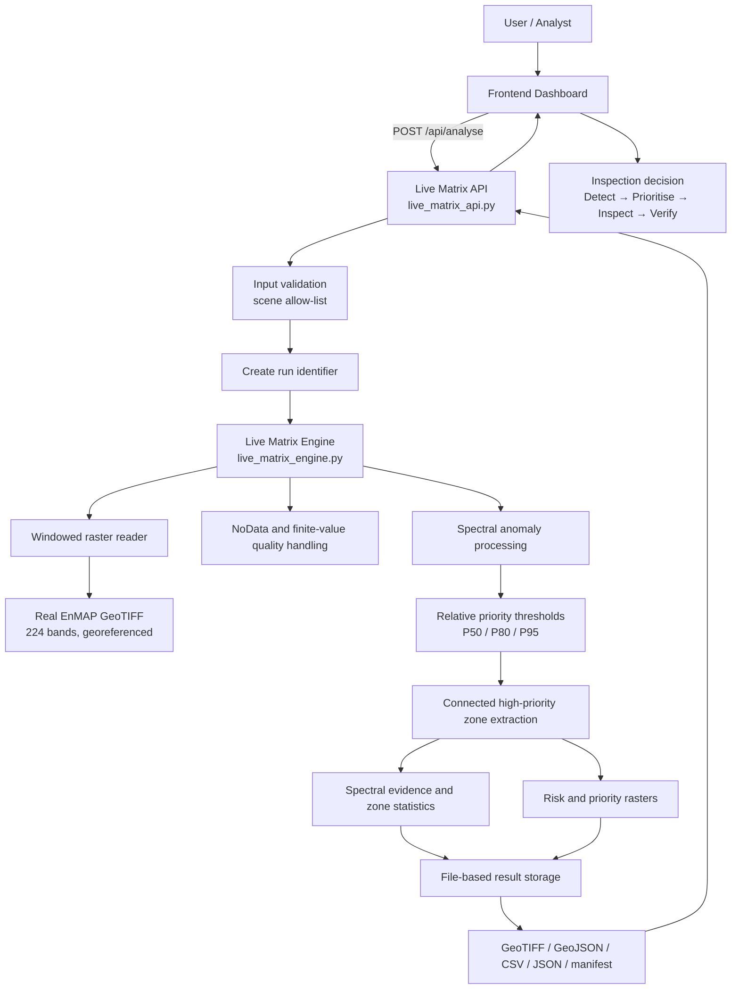
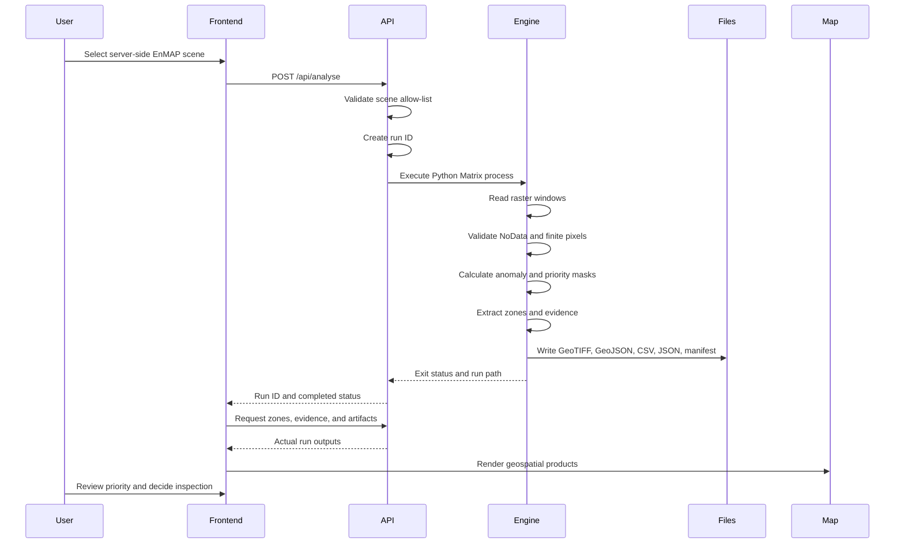
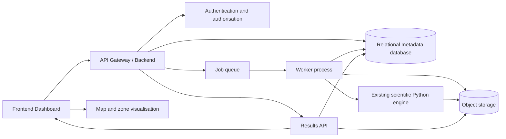

# AgriSpectra-Q — System Architecture

**Document type:** Technical architecture specification  
**Audience:** Frontend, backend, geospatial, scientific Python, REST API, dashboard, and deployment developers  
**Project status:** Industrial-oriented proof of concept

> This document is a technical implementation guide based on the verified AgriSpectra-Q project files and completed runs. It distinguishes **CURRENT**, **REQUIRED FOR THE PoC**, and **FUTURE / INCUBATION** capabilities. It does not treat proposed production components as currently implemented.

## 1. Architecture Summary

AgriSpectra-Q is a hyperspectral Earth Observation decision-support system. Its scientific Python engine is the source of truth. The platform reads real georeferenced EnMAP hyperspectral GeoTIFF scenes, processes valid spectral pixels, calculates spectral-anomaly and priority information, extracts connected priority zones, and produces geospatial and analytical outputs for an inspection team.

The current architecture is:

```text
Frontend / Dashboard
        ↓
Live Matrix API
        ↓
Python Live Matrix Engine
        ↓
Windowed GeoTIFF and spectral processing
        ↓
Spectral-anomaly priority calculation
        ↓
Connected-zone extraction and evidence generation
        ↓
File-based result storage
        ↓
API responses and dashboard visualisation
```

The system also contains a separate frozen scientific benchmark. The benchmark compares six models under a locked evaluation protocol. Its outputs must not be mixed with a newly generated Live Matrix run.

## 2. Current, Required, and Future Architecture

| Capability | CURRENT | REQUIRED FOR THE PoC | FUTURE / INCUBATION |
|---|---|---|---|
| Scientific processing | `agrispectra_q_full.py` and `live_matrix_engine.py` exist. | Preserve the Python engine as the source of truth. | Split stable engine modules and add versioned interfaces. |
| Live execution | `live_matrix_engine.py` runs real EnMAP GeoTIFF scenes. | Backend must invoke the engine, not return fabricated JSON. | Worker-based asynchronous execution. |
| API | `live_matrix_api.py` provides a Flask API. | Validate scene selection and return real run identifiers and outputs. | Production WSGI server, authentication, quotas, and API versioning. |
| Storage | File-based GeoTIFF, GeoJSON, CSV, JSON, manifests, reports, and dashboard data. | Return paths or download endpoints for actual result files. | Object storage plus relational metadata database. |
| Database | No verified PostgreSQL, MySQL, MongoDB, or SQLite database exists. | Do not introduce a database requirement for the current PoC. | PostgreSQL or equivalent metadata store. |
| Dashboard | Static dashboard prototype with an Analysis Lab section. | Display real maps, zones, evidence, status, and mode labels. | Full production web application. |
| Job tracking | A long-running API process exists, but a durable queue is not verified. | Synchronous API execution is acceptable for controlled PoC runs. | Queue, worker, persistent job status, retries, and cancellation. |
| Geospatial output | GeoTIFF and GeoJSON are generated from actual CRS and transforms. | Preserve CRS, dimensions, transform, and pixel-to-coordinate relationships. | Tile services, vector tiling, and cloud-optimised delivery. |
| Scientific benchmark | Frozen six-model results and reports exist. | Label them as `FROZEN SCIENTIFIC BENCHMARK`. | Reproducible benchmark service with immutable manifests. |
| Production deployment | Not verified. | Run in a controlled development environment. | Cloud deployment with security, monitoring, and governance. |

## 3. Core Architecture Diagram

The following diagram describes the current PoC data and control flow. Components marked as file-based are present in the project. A persistent database or queue is not currently claimed.



## 4. Frontend Layer

### 4.1 Current status

The current project contains a dashboard prototype at `results/industrial_validation/dashboard/index.html`. It contains benchmark and operational result displays and an Analysis Lab section that distinguishes **LIVE ANALYSIS** from the **FROZEN SCIENTIFIC BENCHMARK**.

The current frontend is a prototype, not a verified production application. It must not silently substitute saved benchmark data for a newly requested live run.

### 4.2 Responsibilities

The frontend should provide the following user-facing responsibilities:

- Select one of the available server-side EnMAP scenes.
- Start a real analysis run.
- Show the generated run ID.
- Show status and processing duration.
- Display the risk map and priority map.
- Display georeferenced zone overlays.
- Select a zone and show its evidence card.
- Show inspection-budget results.
- Expose model comparison separately from live anomaly analysis.
- Provide downloads for GeoTIFF, GeoJSON, CSV, JSON, and reports.
- Show quality fields such as dimensions, bands, valid pixels, NoData, CRS, and threshold type.
- Show scientific caveats near the decision, rather than hiding them in a separate legal page.

### 4.3 Mode separation

The interface must display a persistent mode badge:

```text
LIVE ANALYSIS
```

or:

```text
FROZEN SCIENTIFIC BENCHMARK
```

Live Analysis means a new execution of the Python Matrix engine on an actual source GeoTIFF. Frozen Scientific Benchmark means a previous controlled experiment with frozen predictions and locked metrics.

The frontend must never combine live zone counts with frozen F1 values as if they were produced by the same run.

### 4.4 Decision-first layout

The user experience should follow this order:

1. **Decision:** “Inspect this zone first.”
2. **Visual evidence:** map location, zone boundary, priority category, and relative score.
3. **Technical evidence:** risk statistics, spectral evidence, metadata, provenance, and limitations.

Raw numerical tables should remain available to expert users, but the first screen should not require a user to interpret a CSV file before understanding the recommended action.

## 5. API Layer

### 5.1 Current API

`live_matrix_api.py` is a Flask development service connected to the actual Python Live Matrix execution layer. It accepts a server-side scene selection, calls the engine as a subprocess, and returns the completed run information.

The verified conceptual endpoints are:

```text
GET  /
POST /api/analyse
GET  /api/runs/{run_id}
GET  /api/runs/{run_id}/zones
GET  /api/runs/{run_id}/spectral-evidence
GET  /api/runs/{run_id}/inspection
GET  /api/runs/{run_id}/report
GET  /api/runs/{run_id}/files/{scene}/{filename}
```

The API has been verified to expose a health-style root response and to execute a real analysis request. The verified scene allow-list includes:

```text
scene_01_DT0000205230
scene_02
scene_03
```

The API returns a run ID and output location after the subprocess completes. The current implementation does not provide a durable database-backed job registry, authenticated users, or a production queue.

### 5.2 Required PoC behaviour

The backend must:

1. Validate the requested scene against an allow-list of server-side datasets.
2. Reject unsupported paths and arbitrary untrusted file access.
3. Create a unique run ID.
4. Call the actual Python engine.
5. Capture exit status and stderr.
6. Return a structured success or failure response.
7. Expose actual output files generated by that run.
8. Preserve the distinction between live and frozen modes.
9. Avoid returning hard-coded benchmark JSON for a live request.
10. Report failures explicitly instead of generating fallback fake outputs.

### 5.3 Proposed production API behaviour

The following behaviour is recommended for a production system but is not currently verified:

```text
POST /api/v1/runs
GET  /api/v1/runs/{run_id}
GET  /api/v1/runs/{run_id}/zones
GET  /api/v1/runs/{run_id}/evidence
GET  /api/v1/runs/{run_id}/artifacts
GET  /api/v1/runs/{run_id}/logs
POST /api/v1/runs/{run_id}/cancel
```

The production API should return `202 Accepted` for asynchronous work, expose a status resource, and return signed or authenticated artifact URLs. These are future design requirements, not current endpoint claims.

## 6. Processing Engine

### 6.1 Current engine responsibilities

The current `live_matrix_engine.py` performs the following operations:

- Opens actual EnMAP GeoTIFF scenes with Rasterio.
- Reads data using raster windows rather than loading the entire raster into memory unnecessarily.
- Identifies finite valid pixels and handles the EnMAP NoData value.
- Calculates a standardized spectral-deviation anomaly score using actual scene spectral information.
- Uses scene-relative P50, P80, and P95 thresholds for operational prioritisation.
- Creates a high-priority mask.
- Extracts connected components from the high-priority mask.
- Removes very small connected components using the configured minimum size.
- Calculates zone statistics and centroid coordinates from the raster transform.
- Writes risk and priority GeoTIFF rasters using the source dimensions, CRS, and transform.
- Writes GeoJSON polygons when the source is georeferenced.
- Writes zone, spectral evidence, inspection-budget, metrics, and manifest files.

The Live Matrix is an unsupervised spectral-anomaly proxy. It does not produce an independently validated disease or pest diagnosis.

### 6.2 Existing scientific model code

`agrispectra_q_full.py` contains the broader modular project architecture, including STAC ingestion utilities, the fixed SAGE-QEC integration boundary, quantum-inspired feature mapping, classical model suites, evaluation utilities, visualisation helpers, ablation metadata, and report support.

The broader pipeline contains a guarded access boundary for authenticated EnMAP assets. It must not claim a completed authenticated remote pixel run when access is unavailable. The live local Matrix run is based on the available local GeoTIFF scenes.

### 6.3 Noise-correction boundary

The supplied SAGE-QEC module is loaded without source modification in the existing architecture. Its native input/output contract must be respected. It should not be silently presented as a reflectance correction layer unless the input and output are scientifically compatible with the raster processing path.

## 7. Data and Mapping Layer

### 7.1 Input contract

The current Live Matrix input is a real georeferenced EnMAP hyperspectral GeoTIFF. The verified live scenes have:

- 224 bands.
- Approximately 30 m spatial resolution.
- An integer raster representation with an EnMAP NoData value of `-32768` in the inspected scenes.
- Valid CRS and affine transform metadata.
- Scene-specific dimensions and coordinate reference systems.

### 7.2 Geospatial invariants

Every processing stage that creates a raster or vector output must preserve:

- CRS.
- Affine transform.
- Width and height.
- Pixel-to-coordinate relationship.
- Raster orientation.
- NoData convention.
- Scene identity.

GeoJSON should be generated only when CRS and geotransform information support a valid coordinate conversion. If a future input is not georeferenced, the system must state that geographic coordinates are unavailable and use pixel coordinates only.

### 7.3 Current output storage

The current storage is file-based. There is no verified traditional database. The current run structure is:

```text
results/
└── live_matrix/
    └── AGRQ-LIVE-<timestamp>-<suffix>/
        ├── scene_01_DT0000205230/
        ├── scene_02/
        ├── scene_03/
        └── run_summary.json
```

Each scene directory contains the files listed in Section 6.1.

## 8. Recommended Directory Architecture

The following is a recommended architecture for future development. It is an implementation proposal, not a claim that the current repository already has exactly this structure.

```text
/project                              # proposed logical structure
├── backend/                          # proposed API and orchestration package
│   ├── api/                          # proposed HTTP route modules
│   ├── jobs/                         # proposed job lifecycle logic
│   └── schemas/                      # proposed request/response schemas
├── engine/                           # proposed stable processing package
│   ├── ingestion/
│   ├── preprocessing/
│   ├── spectral/
│   ├── models/
│   ├── matrix/
│   └── geospatial/
├── models/                           # model artefacts and version manifests
├── data/
│   ├── raw/                          # current local EnMAP data location
│   ├── staging/
│   └── derived/
├── results/                          # current file-based result family
│   ├── live_matrix/
│   └── industrial_validation/
├── frontend/                         # proposed dedicated frontend package
├── static/                           # proposed static assets
├── reports/                          # current and proposed reports
├── manifests/                        # proposed top-level manifest collection
├── tests/                            # recommended unit and integration tests
└── deployment/                       # proposed container and infrastructure files
```

The confirmed current project contains `data/raw`, `results/live_matrix`, `results/industrial_validation`, `agrispectra_q_full.py`, `live_matrix_engine.py`, `live_matrix_api.py`, and the dashboard prototype. The remaining top-level folders in the diagram are recommended logical boundaries, not confirmed current directories.

## 9. Experiment Tracking and Reproducibility

Every real live run should produce a manifest containing at least:

| Field | Purpose |
|---|---|
| `run_id` | Unique immutable identifier. |
| `timestamp` | Execution time. |
| `scene` and source path | Dataset provenance. |
| `mode` | `LIVE_ANALYSIS` or `FROZEN_SCIENTIFIC_BENCHMARK`. |
| `model` or engine version | Computational provenance. |
| Parameters | Thresholds and processing settings. |
| Seed or seeds | Reproducibility where stochastic models are used. |
| Dimensions, bands, CRS, transform | Geospatial and data-quality provenance. |
| Processing time | Operational performance measurement. |
| Status and error | Execution outcome. |
| Output paths | Artifact discovery. |
| Code version | Source reproducibility. |

The current live manifest records run identity, source scene, live mode, CRS, and output lists. Future work should add code commit, dependency lockfile, environment fingerprint, input checksum, threshold configuration, and structured logs.

## 10. Request Lifecycle

The current and intended request flow is:



## 11. Synchronous versus Asynchronous Execution

### 11.1 Current synchronous behaviour

The current API invokes the engine as a subprocess and waits for completion. This is adequate for a controlled PoC because the observed processing times are approximately:

| Scene | Measured processing time |
|---|---:|
| Scene 1 | 37.14 seconds |
| Scene 2 | 111.41 seconds |
| Scene 3 | 49.11 seconds |

The current synchronous approach is simple to debug and provides a direct request-to-result path. It is not suitable for many concurrent users or repeated large-scene jobs without additional resource controls.

### 11.2 Required PoC safeguards

The PoC should apply request timeouts, one or a small bounded number of concurrent runs, explicit subprocess failure handling, output-directory isolation, and progress logging. The API should return a clear error when a run fails. It must not silently reuse an unrelated previous run.

### 11.3 Future asynchronous model

The production architecture should use a job and status model:

```text
POST run request
        ↓
202 Accepted + run_id
        ↓
GET /runs/{run_id}
        ↓
queued → running → completed / failed / cancelled
```

A queue and worker process are future components. They are not currently verified in the project.

## 12. Future Production Architecture

The recommended production architecture is:



This architecture evolves the PoC without rewriting the scientific engine. The engine remains a callable worker component. The API changes from direct subprocess waiting to job submission and status retrieval. File outputs can move from local storage to object storage while retaining the same artifact names and manifest structure. Metadata can move into a database while the actual raster and vector products remain in object storage.

### 12.1 Object storage

Object storage is appropriate for GeoTIFF, GeoJSON, CSV, JSON, reports, and model artefacts. Each run should use an immutable prefix such as:

```text
runs/{run_id}/{scene}/{artifact}
```

A database should store metadata and indexes, not replace the scientific files themselves.

### 12.2 Database

A future relational database can store run state, users, scene catalog entries, artifact metadata, model versions, thresholds, and audit events. The current project does not contain or require such a database.

### 12.3 Worker execution

Workers should run the unchanged or versioned scientific engine in an isolated environment with explicit CPU, memory, disk, and execution-time limits. The exact limits must be measured from deployment hardware; this document does not invent RAM or hardware requirements.

## 13. Large-File Handling and Scalability

EnMAP scenes are large and have many bands. The current engine already uses windowed reads. This should remain the default. The frontend should select server-side datasets instead of transferring a full scene through the browser.

The backend should:

- Read windows or chunks.
- Avoid materialising a full hyperspectral cube in RAM unless a measured algorithm requires it.
- Store intermediate arrays only when necessary.
- Write outputs incrementally where possible.
- Isolate each run directory.
- Apply concurrency limits.
- Track processing time for every stage.
- Reject uploads that exceed configured limits.
- Support AOI or small-subset processing as a secondary workflow.

A free hosting environment may be insufficient for repeated heavy EnMAP processing because execution time, memory, disk, concurrency, and background-process lifetimes may be constrained. This is a deployment-risk statement, not a measured claim about a particular provider. Production capacity must be established through a workload test on the target environment.

## 14. Security Considerations

### 14.1 Current PoC security status

The current Flask service is a development API. It is not verified as an internet-facing production service. It does not provide a complete authentication, authorisation, rate-limiting, audit, or secrets-management layer.

### 14.2 Required protections

A production implementation should:

- Allow-list server-side scene identifiers.
- Never accept arbitrary filesystem paths from the client.
- Validate uploaded files by size, type, and content.
- Store uploads outside executable source directories.
- Prevent path traversal in artifact endpoints.
- Use authentication and role-based authorisation.
- Use HTTPS.
- Apply request and job quotas.
- Restrict subprocess permissions.
- Redact secrets from logs.
- Validate GeoJSON and raster output paths before serving them.
- Record audit events for run creation, download, and deletion.
- Apply retention rules and access controls to data and outputs.

The frontend must not contain provider credentials or service secrets.

## 15. Error Handling

The engine and API should fail explicitly at the stage where a problem occurs. Examples include:

| Failure | Required response |
|---|---|
| Unknown scene | HTTP 400 with an allow-list error. |
| Missing source file | Mark run failed and report the source path. |
| Invalid raster | Stop before processing and report dimensions, bands, or datatype problem. |
| Missing CRS or transform | Produce no geographic GeoJSON; report that only pixel coordinates are available. |
| Inconsistent prediction dimensions | Stop map and zone generation. |
| No valid pixels | Mark the run failed; do not create an empty success result. |
| Worker timeout | Mark the run failed or cancelled and preserve logs. |
| Disk or permission error | Return a structured artifact-write failure. |
| Model dependency error | Mark the run failed and include a dependency diagnostic. |

The system must never generate a fallback fake result when a quality check fails.

## 16. Logging

Every run should produce structured logs with:

- Run ID.
- Scene ID.
- Mode.
- Engine version.
- Stage name.
- Start and end timestamps.
- Duration.
- Input dimensions and band count.
- Valid-pixel count.
- Thresholds.
- Zone count.
- Output paths.
- Warning and error messages.
- Exit status.

Current timing evidence exists at scene level. Future production logging should split timing into data loading, preprocessing, inference, Matrix generation, zone extraction, artifact writing, and total processing time.

Logs must not contain credentials, authentication tickets, or sensitive user information.

## 17. Reproducibility and Scientific Leakage Control

The scientific engine must remain the source of truth. The backend and frontend must not modify model outputs or thresholds after execution.

For benchmark experiments:

- Do not fit preprocessing on the final test set.
- Do not select thresholds using test labels.
- Do not calibrate with test labels.
- Do not optimise Matrix weights using test outcomes.
- Do not select a model based on the final test set and present it as independent validation.
- Preserve train, validation, calibration, and test membership.
- Preserve random seeds and group assignments.
- Store frozen prediction artefacts separately from live outputs.

For Live Matrix anomaly prioritisation, the run manifest must state the threshold definition and whether the calculation is supervised, unsupervised, or proxy-based. A percentile threshold must never be described as a biological disease threshold.

## 18. Output and API Data Contract

A live run can be represented conceptually as:

```text
AnalysisResult
├── run_id
├── mode
├── dataset
├── scene
├── metadata
│   ├── dimensions
│   ├── bands
│   ├── resolution
│   ├── crs
│   └── transform
├── quality
│   ├── valid_pixels
│   ├── nodata_percentage
│   └── finite_value_checks
├── preprocessing
├── model_or_engine
├── metrics
├── risk
│   ├── score_statistics
│   ├── thresholds
│   ├── categories
│   └── area_statistics
├── zones
│   ├── zone_id
│   ├── geometry
│   ├── centroid
│   ├── area
│   ├── risk_statistics
│   ├── priority_rank
│   ├── evidence
│   └── recommendation
├── inspection
│   ├── budgets
│   └── proxy_coverage
├── processing
│   ├── stage_timings
│   └── total_time
├── limitations
└── reproducibility
```

The current implementation stores this information across JSON, CSV, GeoTIFF, and GeoJSON files rather than in one database object. A future Results API may assemble the same logical object without changing the engine output contract.

## 19. Scientific Presentation Rules

The product must be presented as a hyperspectral decision-intelligence system, not as a model that claims to diagnose pixels.

The interface and documentation must never claim:

- Confirmed disease.
- Confirmed pest infestation.
- Confirmed infected field.
- Confirmed biological stress.
- Field-level diagnosis.
- Proven financial ROI.
- Statistically significant superiority over HSI-RF.
- Quantum advantage.
- Field validation.

The correct operational statement is:

> AgriSpectra-Q identifies spectral-anomaly priority candidates from real EnMAP data and provides evidence to support targeted field inspection. Field verification is required.

## 20. Developer Implementation Priorities

1. **Preserve the scientific engine.** Keep `live_matrix_engine.py` and the broader scientific Python implementation as the source of truth. Do not reproduce the scientific logic independently in JavaScript.
2. **Build real API integration.** The API must call the actual engine and return the outputs generated by that run.
3. **Build a decision-oriented dashboard.** Show the recommended inspection action first, then the map and evidence.
4. **Connect real maps.** Render the generated GeoTIFF and GeoJSON products using their actual CRS and transforms.
5. **Connect real zone and evidence data.** Read `zones.csv`, `zones.geojson`, and `spectral_evidence.csv` from the selected run.
6. **Implement real experiment execution.** Use unique run IDs, isolated output directories, explicit status, and failure handling.
7. **Add logging and reproducibility.** Store manifests, timings, parameters, code version, input identity, and output paths.
8. **Avoid fake or demo-only outputs.** Never return static benchmark JSON for a live request, invent coordinates, fabricate spectral evidence, or turn an anomaly proxy into a disease claim.

## 21. Final Architecture Position

The current PoC is a valid file-based architecture for demonstrating real EnMAP processing and georeferenced priority outputs. Its most important architectural property is the separation between the scientific engine and the presentation layer.

The correct evolution path is:

```text
Current PoC:
Frontend → Flask API → Python engine → local files → dashboard

Future production:
Frontend → authenticated API → job queue → worker → scientific engine
         → object storage + metadata database → Results API → dashboard
```

This evolution can preserve the scientific engine and its output contract. The main future work concerns orchestration, persistence, security, monitoring, scalability, and field validation rather than replacing the core spectral processing with a frontend implementation.
