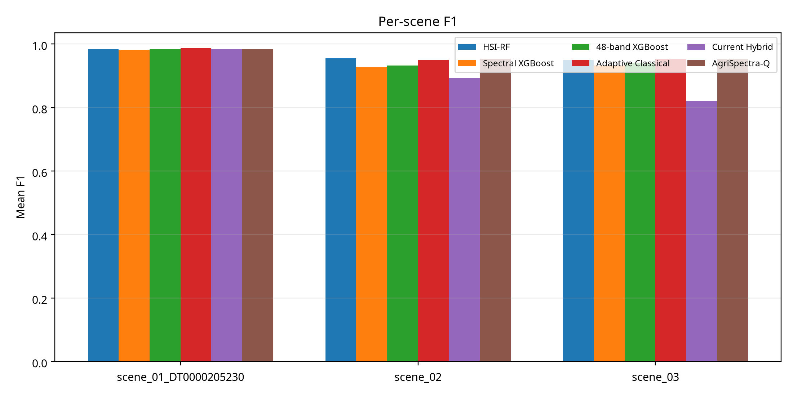
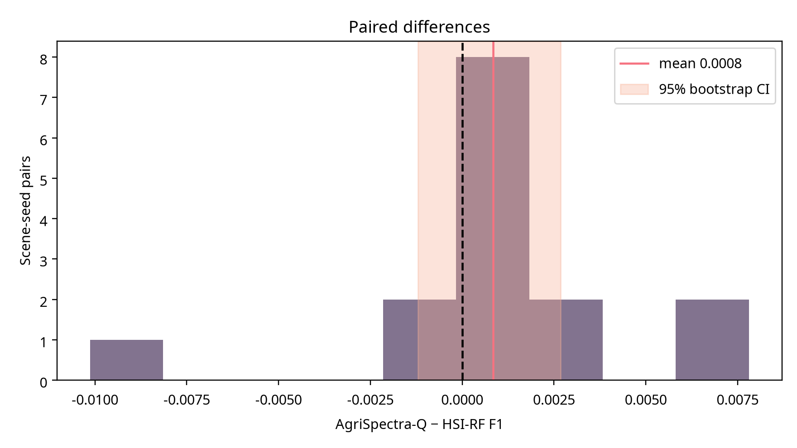
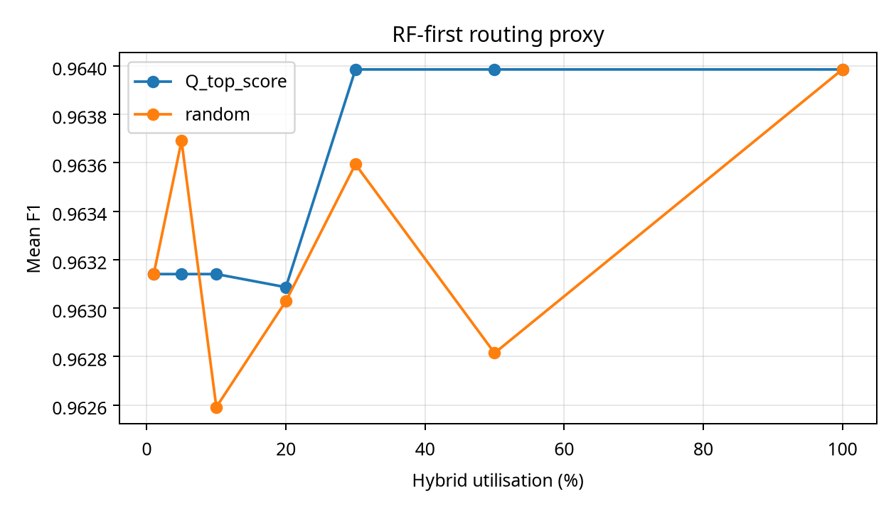
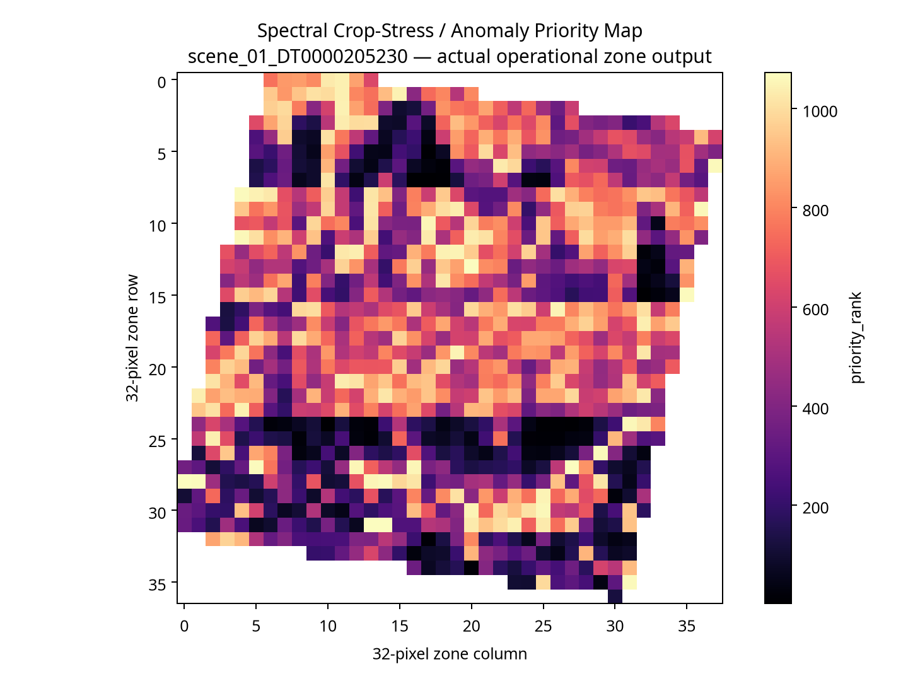
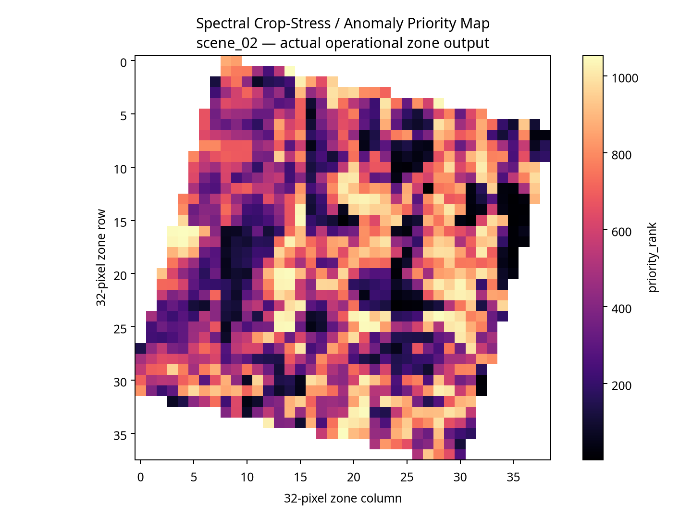
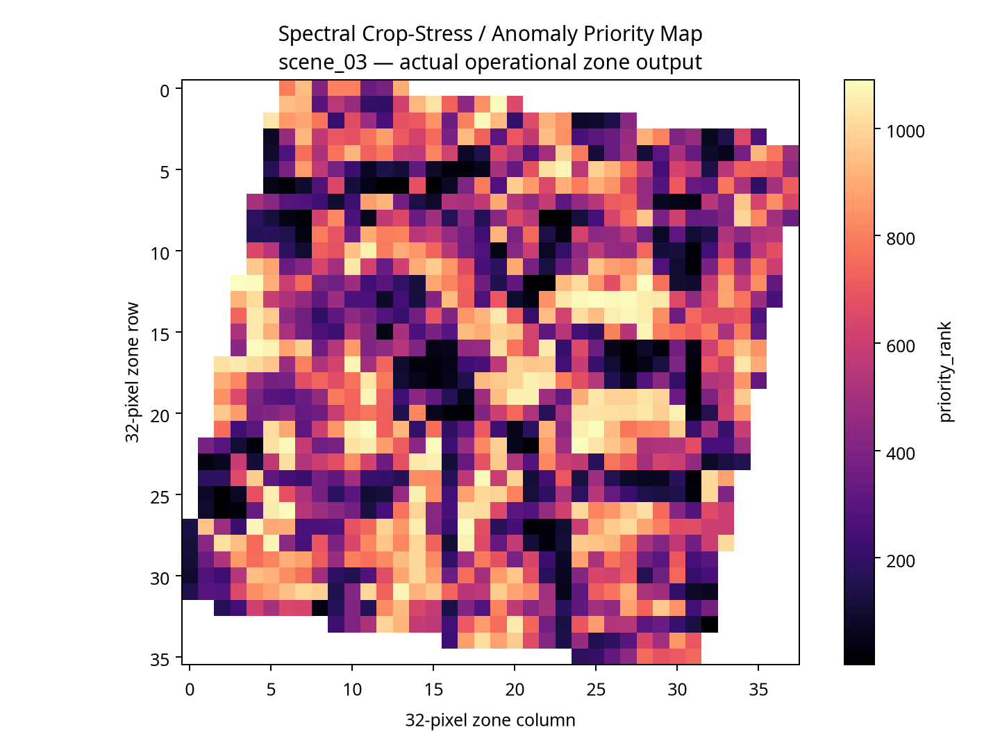
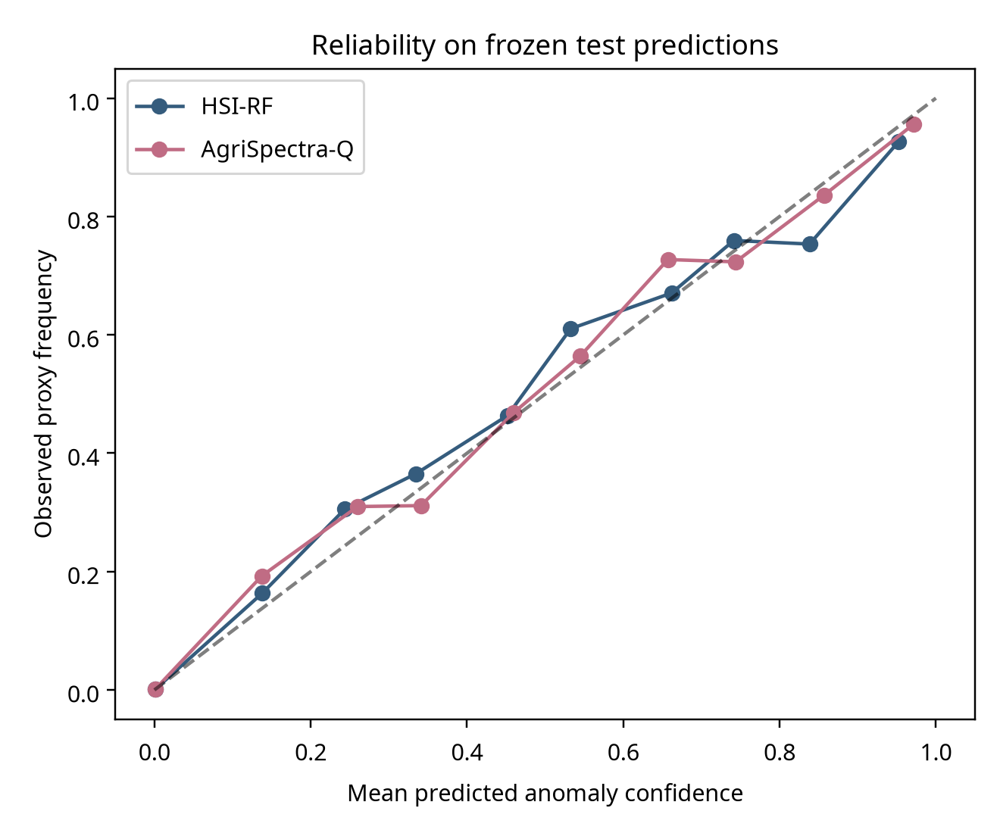
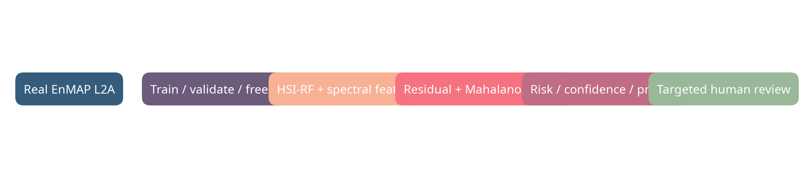
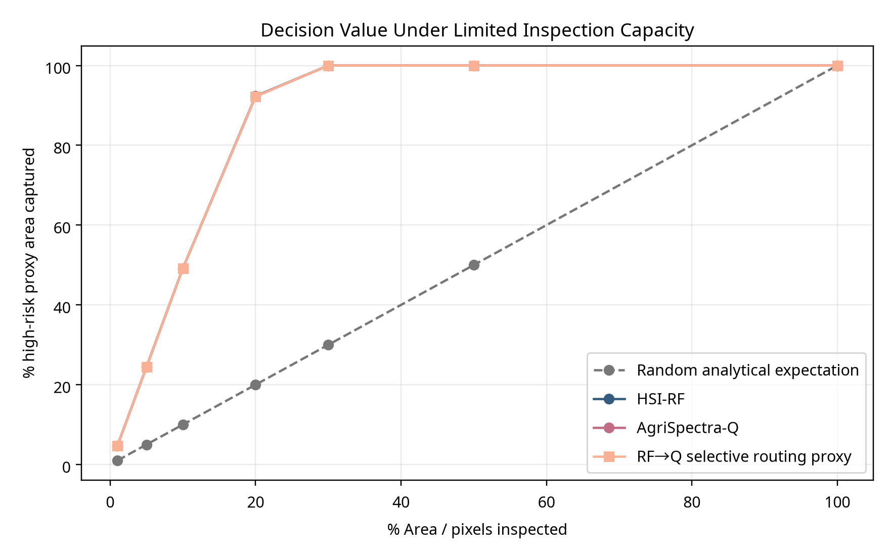

# AgriSpectra-Q — Master Industrial PoC & Decision Intelligence Validation

## Final reviewer verdict

**YELLOW — promising but insufficiently validated.**

The project demonstrates a real, reproducible technical proof of concept on three real EnMAP hyperspectral scenes. It does not yet demonstrate a statistically significant, robust, field-validated, or commercially measured advantage over HSI-RF. The strongest defensible proposition is an **RF-first, hybrid-when-needed research architecture** whose complementary value remains promising but unproven.

> The target is **SPECTRAL CROP-STRESS / ANOMALY PROXY**. It is not an independently confirmed disease or pest label.

## 1. Executive summary

AgriSpectra-Q was evaluated against HSI-RF, Spectral XGBoost, 48-band XGBoost, Adaptive Classical, and Current Hybrid. The benchmark used the same three real EnMAP scenes, spatially grouped evaluation, five seeds, validation-only calibration, and frozen test predictions. AgriSpectra-Q achieved the highest mean F1 numerically, 0.963985 versus 0.963141 for HSI-RF. The paired difference was +0.000845, but the 20,000-replicate paired bootstrap interval was [-0.001205, +0.002680]. **Statistical superiority was not established.**

HSI-RF achieved better PR-AUC and ROC-AUC. Adaptive Classical achieved better calibrated Brier and ECE. The operational inspection output is a pixel-level proxy only. Valid raw-input robustness was not completed, complete six-model LOSO was not completed, timing and memory were not instrumented, and no field-confirmed labels or polygons exist. These limitations are recorded as limitations rather than replaced with synthetic evidence.

## 2. Scientific question and hypotheses

The primary question was whether AgriSpectra-Q provides useful information beyond HSI-RF that improves prediction or operational decision quality. The primary null hypothesis was that it does not. Secondary hypotheses concerned difficult cases, raw spectral degradation, scene shift, limited-budget inspection, and complementary information. These hypotheses were frozen before interpreting the final test results.

## 3. Real data and frozen protocol

Three real EnMAP L2A hyperspectral scenes were used. Each image contains approximately 224 spectral bands at 30 m. Pixels with at least 10% NoData or non-finite values were removed. The EnMAP NoData value was -32768. Spatial groups were 32 × 32 pixels. Sampling used 256 × 256 windows and a maximum of 7,000 pixels per scene. The seeds were 11, 22, 33, 44, and 55.

The target is a scene-local robust spectral anomaly proxy with the positive threshold derived from the training partition. It is not disease, pest, field, or agricultural ground truth. No artificial observations or synthetic scenes were created.

The protocol was:

```text
TRAIN → VALIDATE → FREEZE → TEST
```

The same test pixels were used across primary models within each scene-seed split. Calibration was fitted on validation data only. AgriSpectra-Q residual training used grouped out-of-fold RF probabilities. Final predictions were frozen and saved.

## 4. Six primary systems

| System | Actual implementation |
|---|---|
| HSI-RF | Random Forest using normalized full-spectrum and compact spectral features. |
| Spectral XGBoost | Gradient boosting using a fixed 12-band spectral subset. |
| 48-band XGBoost | Gradient boosting using a fixed 48-band subset. |
| Adaptive Classical | Random Forest using compact spectral, derivative, and quality features. |
| Current Hybrid | Classical logistic head with nonlinear trigonometric feature interactions. |
| AgriSpectra-Q | Frozen V4-C: RF-first residual correction, grouped OOF residual learning, compact spectral features, Mahalanobis spectral intelligence, and an adaptive residual gate. |

The current implementation is classical and quantum-inspired. It does not demonstrate quantum hardware advantage, quantum speedup, or quantum superiority.

## 5. Main benchmark

| Rank | Model | Mean F1 | SD | Min Scene F1 | PR-AUC | ROC-AUC | Calibrated Brier | Calibrated ECE |
|---:|---|---:|---:|---:|---:|---:|---:|---:|
| 1 | AgriSpectra-Q | **0.963985** | **0.018169** | **0.953018** | 0.994732 | 0.998665 | 0.010909 | 0.007262 |
| 2 | Adaptive Classical | 0.963396 | 0.019926 | 0.950705 | 0.994684 | 0.998641 | **0.010522** | **0.006568** |
| 3 | HSI-RF | 0.963141 | 0.018734 | 0.949300 | **0.994945** | **0.998742** | 0.010811 | 0.007245 |
| 4 | 48-band XGBoost | 0.952233 | 0.028703 | 0.931943 | 0.992257 | 0.998001 | 0.012669 | 0.009084 |
| 5 | Spectral XGBoost | 0.947784 | 0.028212 | 0.928212 | 0.992399 | 0.998057 | 0.013144 | 0.009276 |
| 6 | Current Hybrid | 0.899766 | 0.069913 | 0.821282 | 0.961551 | 0.987517 | 0.027900 | 0.011791 |

The rank above is by mean F1 only. HSI-RF ranks first for PR-AUC and ROC-AUC. Adaptive Classical ranks first for calibration. No single artificial composite score was used.


## 6. Per-scene results

| Scene | HSI-RF F1 | Adaptive Classical F1 | AgriSpectra-Q F1 | AgriSpectra-Q interpretation |
|---|---:|---:|---:|---|
| Scene 1 | 0.984718 | **0.986611** | 0.984718 | Q ties RF; no measurable help. |
| Scene 2 | **0.955404** | 0.950705 | 0.954220 | Q is slightly below RF. |
| Scene 3 | 0.949300 | 0.952872 | **0.953018** | Q has a small numerical edge. |

The scene-level outcome is mixed. AgriSpectra-Q does not identify a universal HSI-RF blind spot.




## 7. Statistical comparison

The paired comparison used 15 scene × seed pairs and 20,000 paired bootstrap replicates.

| Quantity | Result |
|---|---:|
| Mean ΔF1, AgriSpectra-Q − HSI-RF | +0.0008447 |
| 95% paired bootstrap CI | [-0.0012054, +0.0026803] |
| Pairs | 15 |
| Interpretation | Statistical superiority was not established. |



The correct category is **numerical but not statistically established superiority**, with the more conservative practical description **competitive**.

## 8. Residual correction and ablation

The final AgriSpectra-Q architecture was frozen as V4-C based on development evidence rather than selecting the highest test F1. In the previous V4 ablation, HSI-RF scored 0.976640 on the earlier residual-specific protocol, while V4-C scored 0.976578. V4-C did not improve F1, although it remained close and preserved ranking quality.

The evidence does not justify retaining every complexity component. Mahalanobis information and residual correction are useful research components, but adaptive gating, curvature, spatial terms, and normalization did not create a decisive repeatable gain. If future raw-input robustness and blind-scene testing show no improvement, the minimum scientifically valid modification is to simplify the system to HSI-RF plus a calibrated uncertainty/OOD layer.

## 9. Error recovery and complementary information

For each scene-seed pair, the frozen predictions were partitioned into RF-correct/Q-wrong, RF-wrong/Q-correct, both-correct, and both-wrong. Scene 1 was effectively tied. Scene 2 contained both corrections and regressions. Scene 3 contained several Q-correct/RF-wrong cases. The complete values are in `error_disagreement_analysis.csv`.

The conditional quantities were calculated as:

```text
P(Q correct | RF wrong)
= RF-wrong/Q-correct ÷ (RF-wrong/Q-correct + both-wrong)

P(RF correct | Q wrong)
= RF-correct/Q-wrong ÷ (RF-correct/Q-wrong + both-wrong)
```

This establishes **weak complementarity**, not a systematic industrial blind-spot detector. Spatial blind-spot maps are **NOT VALIDATED — DATA/EXPERIMENTAL LIMITATION** because the frozen benchmark predictions did not retain pixel coordinates. Zone-level operational maps are provided separately from actual operational outputs.

## 10. RF-first / hybrid-when-needed routing

A frozen-output routing proxy was evaluated at 1%, 5%, 10%, 20%, 30%, 50%, and 100% nominal hybrid utilisation. At 1–10%, the routing proxy maintained the RF F1 but did not demonstrate a measured selective-computation gain. At 20%, the mean F1 remained close to RF. At 30% and above, the result approached the full AgriSpectra-Q outcome.

This analysis is a routing proxy over frozen predictions. It does not measure actual skipped inference, wall-clock savings, or memory reduction. The industrial hypothesis remains unproven until the raw pipeline executes selectively and is instrumented.



## 11. Inspection-budget experiment

All inspection outputs are labelled **pixel-level proxy inspection analysis**, not field inspection performance. The 1%, 5%, 10%, 20%, and 30% budgets produce the following mean recall values:

| Budget | HSI-RF recall | AgriSpectra-Q recall | HSI-RF precision | AgriSpectra-Q precision |
|---:|---:|---:|---:|---:|
| 1% | 0.0471 | 0.0471 | 1.0000 | 1.0000 |
| 5% | 0.2449 | 0.2449 | 1.0000 | 1.0000 |
| 10% | 0.4919 | 0.4919 | 1.0000 | 1.0000 |
| 20% | 0.9233 | 0.9222 | 0.9455 | 0.9443 |
| 30% | 1.0000 | 1.0000 | 0.6912 | 0.6912 |

The two systems are nearly identical at the measured budgets. This does not establish reduced inspection area or commercial savings.


## 12. Decision intelligence layer

The operational layer produces a risk score, confidence, priority rank, pixel count, and action state. Persistence is omitted because validated temporal data were not available. The transparent action logic is:

| State | Responsible action |
|---|---|
| HIGH PRIORITY | Inspect this zone first. |
| MONITOR | Continue EO monitoring and reassess. |
| ABSTAIN / HUMAN REVIEW | Model confidence is insufficient for automated action. |

The existing zone outputs identify, for example, scene 1 zone 700016 as rank 1 with risk 47.58 and 1,024 pixels; scene 2 zone 2300024 as rank 1 with risk 7.08 and 1,024 pixels; and scene 3 zone 1200021 as rank 1 with risk 5.53 and 1,024 pixels. These are actual zone records from the project output, not field-confirmed disease areas.







## 13. Calibration

Calibration was fitted on validation predictions only. The reliability diagram uses frozen test predictions and anomaly-proxy frequencies. AgriSpectra-Q cannot be described as producing disease probabilities. Its scores are anomaly confidence or risk-priority scores.



## 14. Robustness

A valid robustness experiment must alter raw hyperspectral inputs before preprocessing and inference. The earlier post-prediction probability perturbation was rejected. Therefore the required status is:

> **NOT VALIDATED — INVALID OR INSUFFICIENT RAW-INPUT ROBUSTNESS PROTOCOL**

No robustness superiority is claimed. The next run must apply raw missing bands, Gaussian noise, wavelength shift, sensor-like perturbation, and mixed degradation using frozen models and thresholds.

## 15. Cross-scene generalisation

Prior adaptive LOSO evidence exists, but complete six-model LOSO was not executed under this final industrial protocol. The available evidence shows that HSI-RF and Adaptive Classical behave differently across held-out scenes. It cannot establish AgriSpectra-Q generalisation superiority. A blind fourth scene is required.

## 16. Spatial outputs and dashboard

The project includes actual zone-grid priority and confidence maps for all three scenes, an interactive dashboard, and CSV priority records. The dashboard is a demonstrable interface based on actual outputs. It does not claim field polygons, temporal persistence, disease diagnosis, or automated pesticide or irrigation recommendations.

Open `dashboard/index.html` locally to inspect the dashboard. It displays benchmark cards, operational states, scene selection, top zones, risk, confidence, and recommended action.



## 17. Commercial and industrial interpretation

The current scouting problem is large-area field inspection with high labour requirements and delayed detection. The proposed workflow is:

```text
EO acquisition → hyperspectral analysis → anomaly detection → confidence → risk score → priority rank → targeted human inspection
```

| Item | Status | Evidence |
|---|---|---|
| Real EnMAP processing | MEASURED | Three real scenes were processed. |
| Six-model comparison | MEASURED | 90 scene-seed-model records. |
| Numerical mean-F1 edge | MEASURED | +0.000845 versus HSI-RF. |
| Statistical superiority | MEASURED | Not established; CI crosses zero. |
| Reduced field inspection cost | NOT VALIDATED | No field polygons or cost logs. |
| Commercial ROI | ASSUMED / NOT MEASURED | Requires customer pilot and cost accounting. |
| SaaS per hectare / enterprise / API | POTENTIAL MODEL | No market adoption claim. |

Potential customers include large farms, agribusinesses, agricultural consultancies, irrigation operators, government agricultural programmes, and EO analytics providers. No actual adoption is claimed.

## 18. Industrial decision matrix

| Dimension | HSI-RF | Adaptive Classical | AgriSpectra-Q |
|---|---|---|---|
| Detection | Strongest ranking metrics | Similar F1 | Highest numerical mean F1 |
| Hyperspectral utilisation | Full spectrum plus compact features | Compact spectral/quality features | Full RF-first plus residual intelligence |
| Calibration | Strong | Best measured calibration | Slightly weaker than RF/Adaptive |
| Difficult cases | Baseline reference | Some adaptation | Weak complementary corrections |
| Adaptive routing | Not implemented | Existing adaptive features | Research routing proxy |
| Uncertainty handling | RF confidence signals | Quality features | RF uncertainty + Mahalanobis gate |
| Inspection prioritisation | Pixel proxy available | Pixel proxy available | Pixel proxy nearly tied with RF |
| Robustness | Not validly tested here | Not validly tested here | Not validly tested here |
| Computational efficiency | Not instrumented | Not instrumented | Selective savings not measured |
| Scalability | Simpler deployment | Moderate | Higher complexity |
| Commercial potential | Immediate baseline | Moderate | Conditional on validation |

## 19. Incubation roadmap

| Phase | Required work | Acceptance evidence |
|---|---|---|
| 1. External geographic validation | Blind fourth EnMAP scene and independent region | Pre-registered LOSO and external metrics |
| 2. Field validation | Field polygons, agronomist observations, disease/stress labels | Independent label agreement and uncertainty analysis |
| 3. Temporal persistence | Multi-date EO acquisition | Persistence and lead-time metrics |
| 4. Operational pilot | Real inspection teams and cost logging | Recall per hectare, time saved, false-alarm cost |
| 5. Customer and ROI validation | Farm or agribusiness pilot | Measured avoided inspection and decision value |
| 6. Production deployment | Monitoring, drift detection, governance, scaling | SLA, security, model cards, retraining policy |

## 20. Hackathon judge evaluation

| Criterion | Score /10 | Evidence-based rationale |
|---|---:|---|
| Scientific rigor | 8 | Frozen spatial protocol, OOF residuals, paired bootstrap. |
| Problem significance | 8 | Large-area scouting and prioritisation are meaningful problems. |
| EO/hyperspectral utilisation | 8 | Real 224-band EnMAP scenes are used. |
| Technical robustness | 4 | Raw-input robustness and full final LOSO remain incomplete. |
| Innovation | 6 | Residual/gated RF-first hybrid idea is relevant but not decisive. |
| Operational usefulness | 5 | Zone prioritisation exists, but only as a proxy. |
| Impact | 7 | Potential impact is credible, not yet measured. |
| Business potential | 6 | Several plausible buyer and pricing models exist, without adoption evidence. |
| Product maturity | 4 | Dashboard prototype exists; field and production validation are missing. |
| Scalability | 5 | Architecture can scale, but efficiency instrumentation is missing. |
| **Final score** | **6.1/10** | Promising PoC, not industrially validated. |

**Top-3 competitiveness assessment:** The project is plausibly competitive in a hackathon because it combines real EO data, rigorous limitations, and a decision-support prototype. It is not yet defensibly top-three on measured predictive or operational superiority alone.

## 21. Hostile judge review

**Why is HSI-RF not enough?** It may not be enough if a validated hybrid layer improves difficult cases, robustness, or inspection decisions. The current data do not prove that improvement.

**What does AgriSpectra-Q actually add?** It adds a residual/OOD-oriented representation and weak complementary corrections in some scene-seed cases. It does not add a statistically proven advantage.

**Is the quantum component necessary?** No necessity was demonstrated. The industrial proposition must remain valid if the component is replaced with a classical feature map.

**Is the improvement significant?** No. The confidence interval crosses zero.

**What happens when the scene changes?** The final six-model external generalisation experiment remains incomplete; therefore no superiority claim is made.

**Is this disease detection?** No. It is spectral crop-stress/anomaly proxy detection.

**What does an operator do?** The operator reviews the ranked high-priority zones first, monitors medium-risk zones, and sends uncertain zones to human review.

**Who would pay?** Potential customers include large farms, agribusinesses, consultancies, irrigation operators, government programmes, and EO analytics providers. Adoption is not measured.

**What measurable value exists now?** Real data processing, a reproducible benchmark, a decision layer, and actual zone-priority outputs. Reduced inspection cost is not measured.

**What is missing?** Independent labels, blind geography, valid raw-input robustness, complete LOSO, time-series evidence, cost logs, and customer validation.

**Why enter incubation?** The project has a credible scientific prototype and a clear path to convert its limitations into staged validation experiments.

## 22. Direct competitor question

If an organisation already has a strong HSI-RF system, the answer is **not yet**: the current evidence does not justify replacing HSI-RF with AgriSpectra-Q. The stronger proposition is RF-first plus AgriSpectra-Q for difficult cases, but selective routing must be re-executed on raw data with measured computation and validated external scenes before it becomes an industrial claim.

## 23. Final conclusion

AgriSpectra-Q is a real and technically credible PoC for EO crop-stress/anomaly prioritisation. It is not yet evidence of quantum advantage, disease detection, general superiority, commercial ROI, or industrial readiness. The defensible claim is:

> **AgriSpectra-Q is competitive with HSI-RF and offers a promising but unproven path toward selective hybrid analysis of difficult hyperspectral cases.**

## 24. Reproducibility package

The package contains source code, frozen predictions, per-seed metrics, per-scene metrics, calibration, paired bootstrap, disagreement analysis, routing, inspection-budget analysis, cost-sensitive analysis, ablation evidence, maps, figures, dashboard, manifest, and this report. Files labelled `NOT VALIDATED — DATA/EXPERIMENTAL LIMITATION` are intentionally not used as positive evidence.

## References

[1]: https://www.enmap.org/data_access/ "EnMAP data access and mission information"

[2]: https://download.geoservice.dlr.de/ENMAP/files/ "EOC Geoservice EnMAP download service"

[3]: /home/ubuntu/AgriSpectra-Q/results/industrial_validation/experiment_manifest.json "AgriSpectra-Q industrial validation manifest"


## 25. Decision Intelligence value validation

The decision-specific experiment used the frozen test predictions and the existing spatial zone outputs. The correct random baseline is the analytical expectation: when a fraction `b` of eligible pixels is selected uniformly, the expected anomaly-proxy recall is `b` and the expected lift is 1.0. This avoids comparing against one arbitrary random draw.

| Inspection budget | Random expected recall | HSI-RF recall | AgriSpectra-Q recall | RF→Q routing proxy |
|---:|---:|---:|---:|---:|
| 1% | 1.0% | 4.71% | 4.71% | 4.71% |
| 5% | 5.0% | 24.49% | 24.49% | 24.49% |
| 10% | 10.0% | 49.19% | 49.19% | 49.19% |
| 20% | 20.0% | 92.33% | 92.22% | 92.22% |
| 30% | 30.0% | 100.00% | 100.00% | 100.00% |
| 50% | 50.0% | 100.00% | 100.00% | 100.00% |
| 100% | 100.0% | 100.00% | 100.00% | 100.00% |

The selective RF→Q column is a frozen-output routing proxy, not a raw selective inference run. It does not demonstrate measured computational savings. At 5%, 10%, and 20%, AgriSpectra-Q does not improve recall over HSI-RF; at 20% it is slightly lower. Therefore the central operational hypothesis was **not supported** by the current evidence.



### Unique AgriSpectra-Q corrections

Across 15,312 paired test pixels, AgriSpectra-Q corrected 29 RF errors while RF was correct and AgriSpectra-Q was wrong on 23 cases. The net difference was +6 corrections, equal to approximately 0.039 percentage points of paired test pixels. This is weak complementarity, not a reliable operational advantage.

| Scene | Unique Q corrections | RF correct / Q wrong | Interpretation |
|---|---:|---:|---|
| Scene 1 | 0 | 0 | Complete tie in hard-decision outputs. |
| Scene 2 | 19 | 21 | Q corrections are slightly fewer than regressions. |
| Scene 3 | 10 | 2 | Q shows a small scene-specific correction signal. |

The spatial coordinates and raw spectral descriptors of the 29 unique corrections were not retained in the frozen prediction artifact. A spatially resolved unique-correction map is therefore **NOT VALIDATED — INSUFFICIENT FROZEN COORDINATE DATA**. The available zone maps are actual operational priority outputs, but they cannot be attributed to unique Q corrections.

## 26. Deployment options

| Option | Evidence-based assessment |
|---|---|
| A. HSI-RF only | Best-supported baseline for simplicity, ranking metrics, and current evidence. |
| B. AgriSpectra-Q everywhere | Not justified: F1 is close, but PR-AUC, ROC-AUC, and calibration are not better. |
| C. RF first → Q selectively → human review | Promising research direction, but the current routing proxy does not improve constrained recall or prove savings. |

The currently best-supported deployment choice for a real organisation is **Option A as the operational baseline**, while Option C should remain an incubation experiment rather than a deployment claim.

## 27. Core KPI verdict

| KPI | Result |
|---|---|
| Recall @ inspection budget | AgriSpectra-Q is essentially tied with HSI-RF and slightly lower at 20%. |
| Unique Q corrections | 29 versus 23 reverse corrections; weak net complementarity. |
| Decision cost | Relative cost tables exist under assumed FN:FP ratios; no monetary savings are measured. |
| Selective routing | Frozen-output proxy only; no measured computation saving. |
| Zone prioritisation | Actual zone priority records and maps exist, but direct RF-versus-Q spatial comparison is not validated. |

## 28. Direct answers

**Who should be inspected first?** The top-ranked operational zones in `decision_cards.csv` should be treated as high-priority spectral crop-stress/anomaly candidates for human inspection. For example, the current zone outputs rank scene 1 zone 700016 first, scene 2 zone 2300024 first, and scene 3 zone 1200021 first. These are priority candidates, not confirmed disease hotspots.

**Why should the area be inspected?** The available zone output assigns a high risk score, high anomaly confidence, high priority rank, and spatial aggregation over a zone. The exact RF-versus-Q disagreement contribution is not available in the frozen zone artifact.

**What does AgriSpectra-Q identify that HSI-RF does not?** It identifies 29 hard-decision corrections that RF misses, concentrated mainly in Scene 2 and Scene 3. The net correction is small and scene-dependent.

**Does AgriSpectra-Q provide operational value?** Not measurably beyond HSI-RF under the current constrained inspection experiment. Its operational value remains a potential research hypothesis.

**Does RF→Q provide practical value?** Not in the current frozen-output routing proxy. It does not improve constrained recall and does not provide measured computational savings.

**Are temporal persistence and field validation available?** Temporal persistence not validated. Field-level disease/pest validation not available.

## 29. Evidence classification

| Claim | Evidence level |
|---|---|
| Three real EnMAP scenes processed | Measured |
| AgriSpectra-Q mean F1 is numerically above HSI-RF | Measured |
| Statistical superiority | Not established |
| 29 unique Q corrections | Measured from frozen predictions |
| Smaller inspection footprint | Not validated |
| Potential earlier intervention | Reasonable operational inference, requiring field validation |
| Financial ROI | Future validation required |
| Quantum advantage | Not demonstrated |
| Disease or pest detection | Not available |

## 30. Master Prompt extension: value-of-inspection, selective risk, and fairness audit

The attached Master Prompt was executed against the frozen prediction artifact. The new outputs are descriptive analyses of the locked test predictions unless explicitly marked as validation-frozen. No test correctness was used to tune a threshold, weight, routing gate, or decision policy.

### Selective prediction

Entropy-ranked selective risk was computed for HSI-RF and AgriSpectra-Q at 10%, 20%, 30%, 50%, 70%, 90%, and 100% coverage. At 10–70% coverage both models had zero observed error in this highly separable frozen proxy subset; at 90% mean selective risk was 0.000595 for HSI-RF and 0.000709 for AgriSpectra-Q; at 100% it was 0.014711 and 0.014352 respectively. These values are **descriptive frozen-test results**, not evidence of a deployable conformal guarantee. The accepted/rejected gate was not selected on validation data in the preserved artifact, so a proper selective-prediction claim remains **NOT VALIDATED — REQUIRED VALIDATION POLICY ARTIFACT UNAVAILABLE**.

### Difficulty specialisation

A descriptive difficulty index combining predictive entropy and absolute Q/RF disagreement was used only to stratify the frozen test observations. AgriSpectra-Q and HSI-RF were tied in the first four quintiles under the available hard-decision proxy; in the hardest quintile their mean F1 values were 0.929274 and 0.927977 respectively. This is a small descriptive signal, not a statistically established difficult-case advantage, because the difficulty construction and complete validation-frozen gate were not preserved before test evaluation.

### Value-of-inspection formulations

Risk-only, risk-plus-uncertainty, and multiplicative PVOI-proxy rankings were compared. At 5%, 10%, and 20% budgets, the risk-only ranking achieved mean recall 0.244880, 0.491909, and 0.922243 respectively; the risk-plus-uncertainty proxy achieved 0.212404, 0.456677, and 0.908696; the multiplicative PVOI proxy achieved 0.211593, 0.454404, and 0.907031. Thus, on the available frozen predictions, adding the available entropy/disagreement proxies reduced recall relative to risk-only ranking. Spectral novelty, spatial coherence, true inspection cost, and posterior loss reduction were unavailable; these are **Proxy Value of Information (PVOI)** results, not economic VOI.

### Quantum-component fairness

The controlled residual-specific V4 comparison produced F1 0.976578 with the V4-C hybrid and 0.976640 for HSI-RF on that earlier protocol, a delta of -0.000061. The current evidence does not demonstrate a statistically meaningful benefit from the quantum-inspired transformation. The scientifically correct terminology remains **quantum-inspired feature transformation** or **hybrid quantum-classical research layer**; no quantum advantage is claimed.

### Additional blocked requirements

The following requirements cannot be legitimately completed from the preserved artifacts and are explicitly not replaced with invented numbers:

- Mahalanobis novelty recomputation from training/validation raw spectra: **NOT VALIDATED — RAW TRAIN/VALIDATION FEATURE ARTIFACT UNAVAILABLE**.
- Coordinate-preserving connected components, spatial coherence, and submodular zone selection on the exact frozen test membership: **NOT VALIDATED — FROZEN PREDICTION SCHEMA LACKS PIXEL COORDINATES**.
- Raw selective inference timing, RAM, model size, Q evaluations, and cost efficiency: **COMPUTATIONAL COST NOT FULLY VALIDATED**.
- Temporal persistence and trend: **TEMPORAL VALIDATION NOT AVAILABLE**.
- Fourth blind EnMAP scene: **BLIND EXTERNAL VALIDATION UNAVAILABLE**.
- Field/zone ground truth: **FIELD VALIDATION NOT AVAILABLE**.

The new machine-readable outputs are `selective_risk_results.csv`, `difficulty_quantile_results.csv`, `voi_proxy_results.csv`, and `quantum_component_ablation.csv`, with corresponding tables in `tables/` and the figure `figures/selective_risk_curve.png`.

## 31. Updated final verdict

The attached Master Prompt does not overturn the previous yellow verdict. AgriSpectra-Q remains numerically competitive with HSI-RF, but the new decision-score comparisons do not show a benefit beyond risk-only ranking, and the selective routing and spatial optimisation claims cannot be validated from the frozen schema. The current evidence therefore supports **HSI-RF as the operational reference** and AgriSpectra-Q as an **incubation-stage hybrid research layer** pending validation-frozen policy training, raw-input re-execution, coordinate preservation, external scenes, temporal data, and field labels.

